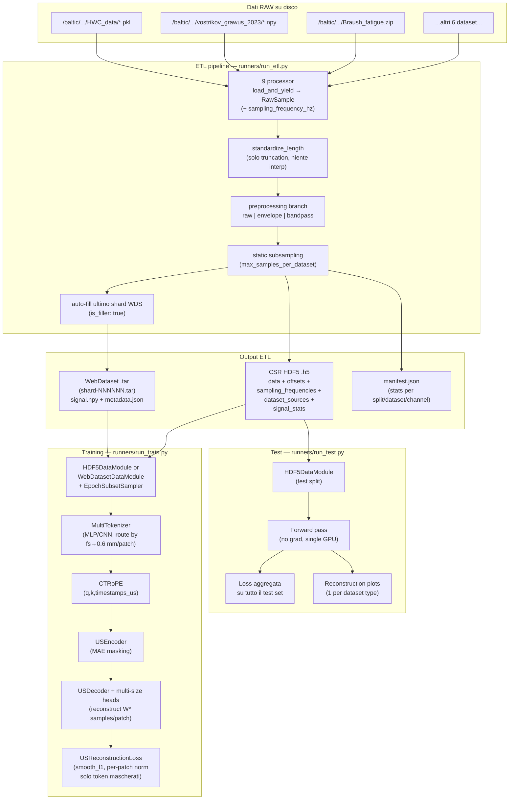

# US Foundation Model — Documentazione completa

Questo documento descrive l'**intera pipeline end-to-end** di `us_foundation` nel suo stato attuale — dall'ingestione dei dati RAW fino al training distribuito del Masked Autoencoder e all'inferenza/valutazione su test set — spiegando come i vari script e moduli si interlacciano.

> Riferimenti architetturali: `BioFoundation` + [`TimeFM`](../TimeFM-us_trf_fm) per il backbone MAE, [`MOIRAI`](../MOIRAI-main) per la logica multi-frequency / `MultiInSizeLinear`, [`MIRA`](../MIRA-main) per il `ContinuousTimeRotaryEmbedding` (CT-RoPE).

---

## 1. Albero del repository

```
us_foundation/
├── configs/
│   ├── etl/
│   │   ├── etl_config.example.yaml      # template documentato (minimal)
│   │   └── etl_config_sassauna.yaml     # config reale server sassauna
│   └── model/
│       ├── base.yaml                    # defaults condivisi (model + data + train)
│       └── experiments/
│           ├── exp_A_mode1_resample.yaml
│           ├── exp_A_mode2_multi.yaml
│           ├── exp_B1_naive.yaml
│           ├── exp_B2_static.yaml
│           ├── exp_B3_dynamic.yaml
│           ├── exp_B4_proportional.yaml
│           ├── exp_C_webdataset.yaml
│           ├── exp_D_preprocessing.yaml
│           └── hdf5_17M_DynamicSampling_FixedS_raw.yaml
├── criterion/
│   ├── __init__.py
│   └── us_reconstruction_loss.py       # USReconstructionLoss (smooth_l1, per-patch norm)
├── etl/                                 # ETL pipeline
│   ├── __init__.py
│   ├── config.py                        # ETLConfig + DatasetConfig
│   ├── standardize.py                   # troncamento / envelope / bandpass
│   ├── writers.py                       # WebDataset + HDF5 (CSR-style)
│   ├── debug.py                         # QA plot (invariato)
│   ├── runner.py                        # orchestrator
│   └── processors/                      # uno script per ogni dataset raw
│       ├── base_processor.py            # RawSample + BaseDatasetProcessor
│       └── [9 processor specifici]
├── data/                                # DataModules PyTorch Lightning
│   ├── __init__.py
│   ├── samplers.py                      # EpochSubsetSampler (dynamic_epoch)
│   ├── signal_tracer.py                 # Debug signal tracing
│   ├── hdf5_datamodule.py               # HDF5Dataset + HDF5DataModule
│   └── webdataset_datamodule.py         # WebDatasetDataModule
├── model/                               # Architettura MAE
│   ├── __init__.py
│   ├── us_mae.py                        # UltrasonicMAE (LightningModule)
│   ├── training_debug.py                # Debug logging durante training
│   ├── tokenizer/
│   │   ├── __init__.py
│   │   └── multi_tokenizer.py           # MLPBranch + CNNBranch + MultiTokenizer
│   ├── positional/
│   │   ├── __init__.py
│   │   └── ct_rope.py                   # CT-RoPE (port da MIRA)
│   └── backbone/
│       ├── __init__.py
│       ├── attention.py                 # MHSA + TransformerBlock con hook CT-RoPE
│       ├── us_encoder.py                # MAE encoder (TimeFM-inspired)
│       └── us_decoder.py                # MAE decoder + multi-size heads
├── schedulers/
│   ├── __init__.py
│   └── cosine.py                        # CosineLRSchedulerWrapper (warmup + cosine)
├── transforms/
│   ├── __init__.py
│   ├── normalization.py                 # normalize_signal_numpy (zscore/minmax/none)
│   └── signal_processing.py            # bandpass, envelope, interpolation (numpy)
├── runners/
│   ├── __init__.py
│   ├── run_etl.py                       # CLI: ETL pass
│   ├── run_train.py                     # CLI: training PL distribuito
│   └── run_test.py                      # CLI: test/inferenza + plot ricostruzione
└── requirements.txt
```

---

## 2. Data flow end-to-end



I moduli sono **completamente disaccoppiati**: l'ETL non sa nulla del modello, il DataModule non sa nulla dell'ETL se non che produce file in un certo layout, e il modello consuma solo batch "tokenizer-ready" indipendenti dal formato sorgente.

---

## 3. Moduli in dettaglio

### 3.1. `etl/` — Extract Transform Load

#### `etl/config.py`

Definisce `ETLConfig` e `DatasetConfig`. `ETLConfig` contiene parametri globali: `target_length` (solo troncatura), `preprocessing_mode` (`raw`|`bandpass`|`envelope`), `output_formats`, `rf_bandwidth_fraction`, `bandpass_order`, `max_samples_per_dataset`, `pad_last_shard`, `split_ratios`, `samples_per_shard`. Ogni `DatasetConfig` ha `name`, `root_dir`, `processor_class`, `split`, e un dict `extra` che può contenere `sampling_frequency_hz`, `transmit_center_frequency_hz`, `rf_bandwidth_fraction` override.

#### `etl/processors/base_processor.py`

Definisce `RawSample(signal, sample_id, source_dataset, channel_idx, sampling_frequency_hz, metadata)` e `BaseDatasetProcessor` con il metodo astratto `load_and_yield()` e l'helper `sampling_frequency_hz()` che legge da `self.config.extra`.

#### `etl/processors/[9 specifici]`

Ogni processor (`hwc`, `grawus`, `lateral_gastrocnemius_verasonics`, `picmus_carotid_cross`, `picmus_carotid_long`, `picmus_in_vivo_heart`, `braush_contraction`, `braush_fatigue`, `giordano_heartrate`) implementa `load_and_yield()` che legge i file raw nel formato specifico di ciascun dataset e yield `RawSample` con la frequenza di campionamento dall'ETL config.

#### `etl/standardize.py`

- `standardize_length(signal, target_length, mode)`: tronca a `target_length` se il segnale è più lungo (mode `left`/`right`/`center`). Nessuna interpolazione.
- `compute_envelope(signal)`: modulo dell'analitico via `scipy.signal.hilbert`.
- `compute_bandpass(signal, fs, low_hz, high_hz, order)`: Butterworth zero-phase.

#### `etl/writers.py`

- **`HDF5Writer`**: layout CSR-style. Un unico buffer 1D `data: (M,) float32` concatena i segnali; `offsets: (N+1,) int64` marca inizio/fine di ciascuno; `sampling_frequencies: (N,) float32`, `dataset_sources: (N,) vlen UTF-8`, `signal_means/stds/mins/maxs: (N,) float32` per normalizzazione. Buffer interni con flush ogni 1024 sample.
- **`WebDatasetWriter`**: `sink.write({"__key__", "signal.npy", "metadata.json"})`. Auto-fill dell'ultimo shard con filler.

#### `etl/runner.py`

Orchestratore in 8 fasi: discover → load_and_yield → standardize → preprocessing → sanitize → static subsampling → split → write (HDF5 e/o WDS) → auto-fill → manifest.

---

### 3.2. `data/` — DataModules PyTorch Lightning

#### `data/hdf5_datamodule.py`

**`HDF5Dataset`**: Dataset random-access per i file CSR HDF5.

- In `__init__`: carica in RAM `offsets`, `sampling_frequencies`, `dataset_sources`, e (se normalization attiva) `signal_means/stds/mins/maxs`. Pre-calcola `window_for_sample[i] = select_branch(fs[i], window_sizes, target_patch_mm)` vettorizzato. In **fixedS mode** (`target_patches != None`) costruisce una mappa `(chunk_sample_idx, chunk_start_offset)` pre-calcolata che associa ogni indice flat a un chunk specifico di un'acquisizione.
- `__getitem__(idx)`: apre il file HDF5 **lazy** (DDP-fork-safe, una apertura per worker). In **variableS** restituisce l'intero segnale. In **fixedS** restituisce un chunk di esattamente `target_patches * W*` campioni (o meno per l'ultimo chunk). Applica online preprocessing (`_apply_online_preprocessing`: bandpass → envelope → interpolation) solo in variableS. Calcola `patch_timestamps_us` per CT-RoPE (midpoint di ogni patch in µs). Ritorna dict con `signal`, `sampling_frequency_hz`, `dataset_source`, `window_size`, `patch_timestamps_us`, `length`, `full_length_samples`, `chunk_index`, `num_chunks`.
- `_finalize_signal_chunk`: applica preprocessing e normalizzazione al segnale.

**`HDF5DataModule`**: Lightning DataModule con 4 strategie di campionamento:

| Strategia | Comportamento |
|---|---|
| `naive` | Iterazione completa ogni epoca |
| `static` | Cap applicati via `dataset_caps` al setup |
| `dynamic_epoch` | `epoch_k` sample da LG per epoca (shuffle diversa ad ogni epoca), split train/val/test del budget; tutto il resto sempre incluso |
| `proportional` | Cap MOIRAI-style via `threshold_ratio` |

Per `dynamic_epoch`: il budget `epoch_k` è suddiviso in train/val/test via `lg_budget_split_ratios` (default 0.8/0.1/0.1). Il train usa `EpochSubsetSampler` che a ogni epoca pesca un nuovo subset random da LG. Val e test usano un subset fisso (determinato dal seed).

**`collate_variable_length`**: padda `signal` e `patch_timestamps_us` al massimo del batch, produce `signal_mask` e `patch_mask` (1=valido, 0=padding).

#### `data/webdataset_datamodule.py`

Pipeline streaming:
```
SimpleShardList → shuffle_shards → split_by_node → split_by_worker
                → tarfile_to_samples → shuffle_buffer → decode
                → map(_decode_sample) → filter(not filler) → batch(collate)
```

`_decode_sample` legge `signal.npy` + `metadata.json`, calcola `W*` e `patch_timestamps_us`. `_estimated_num_batches` usa la garanzia degli shard pieni per la stima con `with_epoch`.

#### `data/samplers.py`

**`EpochSubsetSampler`**: a ogni epoca un subset casuale di `epoch_k` indici dal pool LG viene unito a tutti gli `other_indices`, mescolato, e shardato per rank DDP. Seed = `seed + epoch` → tutti i rank vedono lo stesso subset. `drop_last=True` per lunghezza identica cross-rank.

#### `data/signal_tracer.py`

Utility di debug che produce plot delle trasformazioni segnale (raw → preprocessing → normalizzazione → chunks) quando `signal_trace_enabled=True`.

---

### 3.3. `transforms/` — Trasformazioni online

#### `transforms/normalization.py`

`normalize_signal_numpy(signal, norm_type, mean, std, vmin, vmax, eps_z, eps_mm)`:
- `"none"`: identity
- `"zscore"`: `(signal - mean) / max(std, eps_z)`
- `"minmax"`: `2 * (signal - vmin) / max(vmax - vmin, eps_mm) - 1` → range [-1, 1]

`validate_normalization_type(t)` controlla che sia uno dei valori validi.

#### `transforms/signal_processing.py`

Funzioni NumPy per preprocessing online (eseguito nel DataLoader worker):

- `compute_bandpass_numpy(signal, fs, low_hz, high_hz, order)`: Butterworth zero-phase.
- `compute_envelope_numpy(signal)`: modulo dell'analitico via Hilbert.
- `compute_interpolation_numpy(signal, target_length, truncate_mode)`: resampling a `target_length` via `np.interp` con griglia lineare. `truncate_mode` (`left`/`right`/`center`) determina quale porzione viene presa se il segnale è già più lungo di `target_length`.
- `bandpass_edges_from_center_frequency(fc, bw_frac, fs)`: calcola `low/high` Hz per il bandpass dato fc e larghezza di banda relativa.

---

### 3.4. `model/` — Architettura MAE

#### `model/tokenizer/multi_tokenizer.py`

**Routing fisico** (`select_branch`): per ogni sample minimizza `|W·c/(2·fs) − target_mm|` su `W ∈ window_sizes` con `c = 1540 m/s`. Il DataModule pre-calcola questo e lo passa nel batch come `window_size (B,)`.

**Tokenizer branches** (selezionabili via `tokenizer_type`):

- **`MLPBranch`** (default): reimplementa `MultiInSizeLinear` di MOIRAI. Peso `(num_W, E, max_W)` + mask `(num_W, 1, max_W)`. Forward: flatten patches → per ogni `W_i`, se `branch_idx == i` applica `F.linear`. Init Kaiming-uniform.
- **`CNNBranch`**: `nn.ModuleList` di `Conv1d` (uno per W) con parametri configurabili (kernel_size, stride, groups, padding, bias).

**`MultiTokenizer.forward`**: riceve `signal (B, T)`, `signal_mask (B, T)`, `sampling_frequency_hz (B,)`, opzionale `window_size_override (B,)`. Patchifica il segnale in `(B, S, W)`, flatten a `(B, S, max_W)` con zero-padding, routea al branch corretto, produce `TokenizerOutput(tokens (B, S, E), padding_mask (B, S), window_size (B,), patch_timestamps_us (B, S), sampling_frequency_hz (B,))`.

In **fixedS mode** (`fixed_num_patches != None`): tronca/padda a esattamente `(B, target_patches, E)` con maschera di padding per i patch non validi.

#### `model/positional/ct_rope.py`

**`CTRoPE(dim, base=10000.0)`**: Continuous-Time Rotary Positional Encoding (port da MIRA). `forward(q, k, time_values) → (q_rot, k_rot)` con:
- `q, k: (B, H, S, D)`
- `time_values: (B, S)` — midpoint timestamps in µs

Formula: `θ_i(t) = base^(−2i/d) · t`, rotazione via `rotate_half`.

Differenza da RoPE classico: gli angoli sono proporzionali a **valori di tempo assoluti** (non indici di posizione), rendendo il PE sensibile alla distanza temporale fisica tra patch — cruciale quando i patch provengono da segnali a diverse frequenze di campionamento.

#### `model/backbone/attention.py`

**`MultiHeadSelfAttention`**: attention standard con hook opzionale `rotary(q, k, time_values)` per CT-RoPE. Supporta `padding_mask` che setta a `-inf` le key padded. Dropout su attention weights.

**`TransformerBlock`**: pre-norm architecture (LN → MHSA → residual → LN → MLP → residual). MLP: 2-layer con GELU e espansione `mlp_ratio` (default 4x).

#### `model/backbone/us_encoder.py`

**`USEncoder(embed_dim, depth, num_heads, mlp_ratio, masking_ratio, dropout, rotary)`**:

1. Riceve `tokens (B, S, E)` dal tokenizer (nessuna patch_embed interna).
2. Sostituisce token padded con `pad_token` (parametro learnable).
3. **MAE masking** (`_mae_shuffle_and_mask`): i token padded ricevono rumore `2.0` → finiscono in coda dopo argsort → garantiti tra i "masked". Per ogni sample: `len_keep[b] = round((1 − masking_ratio) · n_valid[b])`, clamped ≥ 1.
4. Seleziona i `S_vis_max = max(len_keep)` token visibili per il batch.
5. Processa con `depth` TransformerBlocks passando CT-RoPE e `time_values_visible`.
6. Ritorna: `{"latent": (B, S_vis_max, E), "ids_restore": (B, S), "mask": (B, S), "len_keep": (B,)}`.

Init: Xavier per Linear, costanti per LayerNorm, `trunc_normal_` per mask/pad token, rescale proj weights à la TimeFM (`div_(sqrt(2·layer_id))`).

#### `model/backbone/us_decoder.py`

**`USDecoder(encoder_dim, decoder_dim, decoder_depth, decoder_heads, mlp_ratio, window_sizes, rotary)`**:

1. Proietta `latent` da `encoder_dim → decoder_dim`.
2. Reinserisce `mask_token` per le posizioni mascherate.
3. **Unshuffle** con `gather(ids_restore)` per ripristinare l'ordine originale.
4. Processa con `decoder_depth` TransformerBlocks + CT-RoPE.
5. **Multi-size reconstruction head**: tre `nn.Linear` separati (`heads["8"]`, `heads["16"]`, `heads["32"]`), uno per window_size. Aggrega con `(window_size_per_sample == w) * head_w(x)`, padda a `W_max`.
6. Ritorna: `pred (B, S, W_max)`.

#### `model/us_mae.py`

**`UltrasonicMAE(LightningModule)`**: modulo principale che cabla tutto.

- `__init__`: istanzia `MultiTokenizer`, due `CTRoPE` separate (head_dim può differire tra encoder e decoder), `USEncoder`, `USDecoder`, `USReconstructionLoss`. `save_hyperparameters()` per checkpoint reproducibili.
- `forward(batch)`: tokenizer → encoder → decoder → ritorna `{"pred", "mask", "padding_mask", "window_size"}`.
- `_step(batch, stage)`: forward + loss, logga `{stage}/loss`, `{stage}/masked_loss`, `{stage}/visible_loss`.
- `training_step` / `validation_step` / `test_step`: wrapper di `_step`.
- `configure_optimizers`: `AdamW` con 2 param groups (decay vs no-decay per bias, LayerNorm, mask/pad_token). `CosineLRSchedulerWrapper` con linear warmup e cosine decay step-based.

---

### 3.5. `criterion/` — Funzione di loss

#### `criterion/us_reconstruction_loss.py`

**`USReconstructionLoss(loss_type, alpha, norm_target, norm_eps)`**:

- `loss_type`: `"smooth_l1"` (default) | `"l1"` | `"l2"`
- `norm_target`: se True (default), normalizza ogni target patch a zero mean / unit std (trick MAE He et al. 2021)
- `alpha`: peso per loss su patch visibili. `alpha=0` (default) = puro MAE (solo masked loss). `alpha > 0` = anche auxiliary visible loss (come TimeFM).

Forward: per ogni `W` unico nel batch, patchifica il segnale originale `(B, T) → (B, S, W)`, normalizza per-patch, calcola loss element-wise solo dove `mask=1 & padding_mask=1 & valid=1`. Ritorna `{"loss", "masked_loss", "visible_loss"}`.

---

### 3.6. `schedulers/` — Learning rate scheduling

#### `schedulers/cosine.py`

**`CosineLRSchedulerWrapper`**: wrappa `timm.scheduler.CosineLRScheduler`. Supporta linear warmup per `warmup_epochs` (convertiti in step) poi cosine decay fino a `min_lr`. Interfaccia step-based (`t_in_epochs=False`), integrato con PL via `lr_scheduler_step → step_update(global_step)`.

---

### 3.7. `runners/` — Script CLI

#### `runners/run_etl.py`

CLI per la pipeline ETL. Accetta `--config` (YAML ETL) + override opzionali (`--preprocessing_mode`, `--output_dir`). Lancia `etl.runner.run()`.

#### `runners/run_train.py`

CLI per il training Lightning distribuito:

- **Config composition** (`_load_composed_yaml`): implementa `defaults: [base]` Hydra-like con `_deep_update` ricorsivo. I file base sono risolti relative al parent del file esperimento.
- **CLI overrides** (`_apply_overrides`): `--override train.max_epochs=50 model.embed_dim=512` (dot-path + yaml.safe_load del valore).
- **DataModule factory** (`_build_datamodule`): switch `hdf5|webdataset`, passa tutti i parametri dal config.
- **Model factory** (`_build_model`): istanzia `UltrasonicMAE` con parametri da `cfg["model"]` + `cfg["train"]`.
- **Trainer**: `pl.Trainer` con `DDPStrategy(find_unused_parameters=False)` quando multi-GPU/multi-nodo, `bf16-mixed` di default, `ModelCheckpoint(monitor="val/loss", save_top_k=3, save_last=True)`, `LearningRateMonitor`, `CSVLogger` + opzionale `WandbLogger`. Salva `config.yaml` nel run directory. Supporta `--ckpt-path` per resume.

#### `runners/run_test.py`

CLI per l'inferenza e valutazione su test set:

- **Input**: `--test-data` (path a test.h5), `--config` (YAML flat come salvato dal training), `--checkpoint` (.ckpt).
- **Opzioni**: `--num-samples` (quanti plot per dataset, default 3), `--output-dir`, `--device`, `--batch-size`.
- **Esecuzione**: loop manuale (no pl.Trainer) su singola GPU con `torch.no_grad()`. Per ogni batch: forward → calcolo loss → raccolta sample per i plot.
- **Modalità fixedS**: accumula i chunk per ogni acquisizione (identificata da `dataset_source`). Quando tutti i `num_chunks` di un'acquisizione sono presenti, li stitch-a in ordine di `chunk_index` per ricostruire l'intero segnale originale nel plot.
- **Modalità variableS**: ogni item del batch è già un segnale completo.
- **Output**: loss media su stdout + plot di ricostruzione PNG (uno per dataset × num_samples) in `output_dir/reconstruction_plots/`. Ogni plot mostra: originale (viola), ricostruito (rosa), residuo (arancione), zone mascherate (bande grigie).

---

## 4. Interfacce chiave fra i moduli

Questa tabella riassume i "contratti" tra i vari blocchi — ogni riga è un punto di contatto in cui lo schema dei dati è rigido.

| Produttore | Consumatore | Schema |
|---|---|---|
| `processors/*.py` | `etl/runner.py` | `RawSample(signal: np.ndarray, sample_id, source_dataset, channel_idx, sampling_frequency_hz, metadata)` |
| `etl/writers.HDF5Writer` | `data/hdf5_datamodule.HDF5Dataset` | `data[offsets[i]:offsets[i+1]]` + `sampling_frequencies[i]` + `dataset_sources[i]` + stats opzionali |
| `etl/writers.WebDatasetWriter` | `data/webdataset_datamodule` | per sample: `<key>.signal.npy` + `<key>.metadata.json` (con `sampling_frequency_hz`, `dataset_source`, `is_filler`) |
| `HDF5Dataset.__getitem__` | `collate_variable_length` | `{signal, sampling_frequency_hz, dataset_source, window_size, patch_timestamps_us, length, full_length_samples, chunk_index, num_chunks}` |
| `collate_variable_length` | `UltrasonicMAE.forward` | batch dict: `{signal (B,T), signal_mask (B,T), sampling_frequency_hz (B,), window_size (B,), patch_timestamps_us (B,S), patch_mask (B,S), length (B,), dataset_source: list[str]}` |
| `MultiTokenizer.forward` | `USEncoder.forward` | `TokenizerOutput(tokens (B,S,E), padding_mask (B,S), window_size (B,), patch_timestamps_us (B,S), sampling_frequency_hz (B,))` |
| `USEncoder.forward` | `USDecoder.forward` | `{"latent": (B,S_vis,E), "ids_restore": (B,S), "mask": (B,S), "len_keep": (B,)}` |
| `USDecoder.forward` | `USReconstructionLoss` | `pred (B, S, W_max)` |

Il punto delicato di tutta la catena è il **padding level shift**: l'ETL salva segnali a **lunghezza nativa** (niente padding), il collate padda a `T_max` del batch, il tokenizer padda a `S_max` del batch (token-level), e il decoder produce `(B, S, W_max)` con la head `W*` selezionata per sample.

---

## 5. Modalità di batching: variable-S vs fixed-S

Due modalità di batching sono supportate (switch globale via `data.target_patches`):

| Modalità | `target_patches` | Forma `tokens` | Lunghezza segnale per sample | Chunking |
|---|---|---|---|---|
| **variable-S** (default) | `null` | `(B, S_max, E)`, `S_max` varia per batch | nativa, collate padda a `T_max` | no |
| **fixed-S** (MOIRAI-like) | `int`, es. `50` | `(B, target_patches, E)` sempre | esattamente `target_patches · W*` (o ultimo chunk residuo) | sì, deterministico |

**Rationale fixed-S**: in variable-S un batch con sample a W=8 e W=32 ha token-padding aggressivo perché `S_max = max_b(T_b // W_b)` — i sample W=32 finiscono al 75% di padding. Con `target_patches = 50`, il DataModule taglia ogni acquisizione in chunk di `50 · W*` campioni (tutti i chunk vengono visti), i sample corti producono un singolo chunk con valid_patches < 50. Il transformer lavora sempre su `(B, 50, E)` → compute e memoria costanti, DDP bilanciato.

**Differenze da MOIRAI**: MOIRAI fissa `max_length` in token space (globale) e usa PatchCrop (random crop) + PadCollate/PackCollate. La nostra variante fissa `target_patches` e deriva il target in signal space per ogni branch (`target_T = target_patches · W`), con chunking deterministico: tutti i chunk visti (nessun dato perso), S costante.

---

## 6. Online preprocessing (variableS only)

Quando `preprocessing_mode != "raw"` o `apply_interpolate = True`, il DataLoader applica trasformazioni **per-sample nel worker**:

1. **Bandpass** (se `mode == "bandpass"` o `mode == "envelope"`): `compute_bandpass_numpy(signal, fs, low, high, order)` con frequenze derivate da `transmit_center_frequency_hz` e `rf_bandwidth_fraction` del dataset.
2. **Envelope** (se `mode == "envelope"`): `compute_envelope_numpy(signal)` dopo il bandpass.
3. **Interpolation** (se `apply_interpolate == True`): `compute_interpolation_numpy(signal, target_length, truncate_mode)` resampling a lunghezza fissa.

Queste trasformazioni sono **incompatibili con fixedS** (il chunking avviene sui dati raw, non post-processing). In fixedS + raw il segnale va direttamente dalla lettura HDF5 alla normalizzazione.

---

## 7. Config YAML: formato flat (output del training)

A fine training, `run_train.py` salva in `{output_dir}/{run_name}/config.yaml` un YAML **flat** (senza `defaults`) con tre sezioni: `data`, `model`, `train`. Questo è il formato accettato da `run_test.py`:

```yaml
data:
  apply_interpolate: true/false
  batch_size: 512
  format: hdf5
  hdf5_dir: /path/to/hdf5/
  normalization_type: minmax
  preprocessing_mode: raw
  target_patches: null  # or int for fixedS
  # ... tutti gli altri parametri data
model:
  embed_dim: 512
  encoder_depth: 8
  encoder_heads: 8
  decoder_dim: 256
  decoder_depth: 4
  decoder_heads: 8
  masking_ratio: 0.5
  window_sizes: [28]
  target_patch_mm: 0.6
  tokenizer_type: mlp
  use_ct_rope: true
  # ... tutti gli altri parametri model
train:
  lr: 1e-4
  max_epochs: 200
  seed: 42
  # ... tutti gli altri parametri train
```

---

## 8. Vincoli invariati e decisioni chiave

- **Nessuna interpolazione in ETL** — i segnali mantengono frequenza e lunghezza native, condizione necessaria per la validità fisica del multi-tokenizer.
- **CSR-like HDF5** per segnali variable-length senza zero-padding: risparmio di storage proporzionale alla varianza di lunghezza; `offsets` (17M × 8 B ≈ 136 MB) caricati in RAM al `__init__` del dataset.
- **WebDataset metadata per sample** (non per shard): `sampling_frequency_hz`, `dataset_source`, `is_filler` sono top-level nel `metadata.json`.
- **Padding last shard**: evita NCCL hang su DDP con epoche classiche. Filler marcati nel metadata e scartabili in validation.
- **Routing fisico**: `W* = argmin_{W∈{8,16,32}} |W·c/(2·fs) − 0.6 mm|`. Stessa funzione usata in DataModule **e** in tokenizer per garantire coerenza.
- **CT-RoPE applicato dentro i blocchi** (non come PE additivo sui token): Q/K ruotati a ogni layer.
- **Reconstruction head a Linear separati**: una per window_size, più leggibile di `MultiOutSizeLinear` con pochi branch.
- **Solo HDF5 supporta `dynamic_epoch`**: l'astrazione stream-based di WebDataset è incompatibile con seeking random per-epoca.
- **`samples_per_shard % batch_size == 0`** e `n_shards % (world_size · num_workers) == 0` validati in `ETLConfig.validate()`.

---

## 9. Dataset e frequenze di campionamento

| Dataset | fs | W* scelto (target 0.6 mm) |
|---|---|---|
| `hwc` | 10 MHz | 8 (0.77 mm) |
| `grawus` | 10 MHz | 8 (0.77 mm) |
| `lateral_gastrocnemius_verasonics` | 20 MHz | 16 (0.62 mm) |
| `picmus_carotid_long/cross`, `picmus_in_vivo_heart` | 40.82 MHz | 32 (0.60 mm) |
| `braush_contraction`, `braush_fatigue` | 8 MHz | 8 (0.96 mm) |
| `giordano_heartrate` | 12 MHz | 8 (0.51 mm) |

---

## 10. Come lanciare i vari stadi

### 10.1. ETL

```bash
# Dentro us_foundation/
python -m runners.run_etl \
    --config configs/etl/etl_config_sassauna.yaml

# Override preprocessing:
python -m runners.run_etl \
    --config configs/etl/etl_config_sassauna.yaml \
    --preprocessing_mode envelope \
    --output_dir /scratch/output_envelope
```

### 10.2. Training

```bash
# Single-node 4xA100:
python -m runners.run_train \
    --config configs/model/experiments/exp_A_mode2_multi.yaml

# Con override:
python -m runners.run_train \
    --config configs/model/experiments/exp_B3_dynamic.yaml \
    --override train.max_epochs=50 data.batch_size=128

# Multi-nodo Leonardo (via SLURM):
#   srun python -m runners.run_train \
#       --config configs/model/experiments/exp_A_mode2_multi.yaml \
#       --override train.devices=4 train.num_nodes=4
```

### 10.3. Test / Inferenza

```bash
python -m runners.run_test \
    --test-data /path/to/test.h5 \
    --config /path/to/config.yaml \
    --checkpoint /path/to/model.ckpt \
    --num-samples 3 \
    --output-dir /path/to/output
```

Per lanciare il test. Lo script:
1. Carica il config YAML flat (come salvato a fine training).
2. Costruisce un `HDF5DataModule` per la split di test.
3. Carica il modello dal checkpoint.
4. Esegue forward pass su tutti i batch del test set (singola GPU, no grad).
5. Stampa la loss media aggregata.
6. Genera plot di ricostruzione (Original vs Reconstructed vs Residual + Mask) per ogni tipo di dataset presente nel test set.

---

## 11. Test rapidi di sanità

```bash
# Syntax check di tutto il repo:
python -c "import ast, pathlib; [ast.parse(p.read_text()) for p in pathlib.Path('.').rglob('*.py')]"

# Training smoke test (1 batch, 1 epoch, CPU):
python -m runners.run_train \
    --config configs/model/experiments/exp_A_mode2_multi.yaml \
    --override train.max_epochs=1 train.devices=1 train.accelerator=cpu train.precision=32 data.batch_size=4 data.num_workers=0
```

Tutti gli import intermodulari sono indiretti tramite package `__init__.py` (`from data import HDF5DataModule, …`, `from model import UltrasonicMAE`), quindi un eventuale refactor interno di un sottomodulo non rompe i runner.
