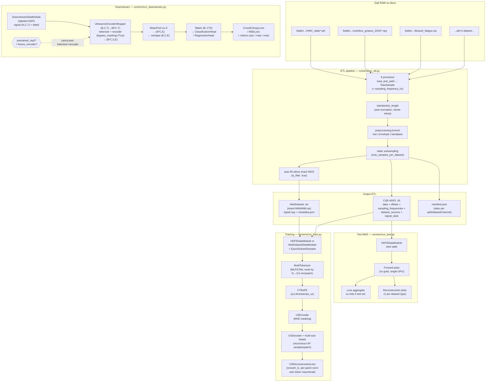

# US Foundation Model — Documentazione completa

Questo documento descrive l'**intera pipeline end-to-end** di `us_foundation` nel suo stato attuale — dall'ingestione dei dati RAW fino al training distribuito del Masked Autoencoder, all'inferenza/valutazione su test set, e ai **task downstream** (classification / regression) costruiti sopra l'encoder pre-trainato — spiegando come i vari script e moduli si interlacciano.

> Riferimenti architetturali: `BioFoundation` + [`TimeFM`](../TimeFM-us_trf_fm) per il backbone MAE e per la struttura del task downstream (freeze toggle, head separata, layerwise LR decay), [`MOIRAI`](../MOIRAI-main) per la logica multi-frequency / `MultiInSizeLinear`, [`MIRA`](../MIRA-main) per il `ContinuousTimeRotaryEmbedding` (CT-RoPE). Per il fine-tune end-to-end l'implementazione segue la ricetta MAE di He et al. 2021 (layerwise LR decay, head lineare, warmup + cosine).

---

## 1. Albero del repository

```
us_foundation/
├── configs/
│   ├── etl/
│   │   ├── etl_config.example.yaml      # template documentato (minimal)
│   │   └── etl_config_sassauna.yaml     # config reale server sassauna
│   └── model/
│       ├── base.yaml                    # defaults condivisi MAE (model + data + train)
│       ├── base_downstream.yaml         # defaults condivisi downstream (eredita da base)
│       └── experiments/
│           ├── exp_A_mode1_resample.yaml
│           ├── exp_A_mode2_multi.yaml
│           ├── exp_B1_naive.yaml
│           ├── exp_B2_static.yaml
│           ├── exp_B3_dynamic.yaml
│           ├── exp_B4_proportional.yaml
│           ├── exp_C_webdataset.yaml
│           ├── exp_D_preprocessing.yaml
│           ├── hdf5_17M_DynamicSampling_FixedS_raw.yaml
│           ├── cls_linear_probe.yaml    # downstream: pretrained encoder frozen, solo head
│           ├── cls_finetune.yaml        # downstream: pretrained encoder unfrozen, FT
│           └── cls_scratch.yaml         # downstream: encoder random-init (ablation)
├── criterion/
│   ├── __init__.py
│   └── us_reconstruction_loss.py       # USReconstructionLoss (smooth_l1, per-patch norm)
├── etl/                                 # ETL pipeline (pretraining)
│   ├── __init__.py
│   ├── config.py                        # ETLConfig + DatasetConfig (shared with etl_downstream)
│   ├── standardize.py                   # troncamento / envelope / bandpass
│   ├── writers.py                       # WebDataset + HDF5 (CSR-style)
│   ├── debug.py                         # QA plot (reused by etl_downstream)
│   ├── runner.py                        # orchestrator
│   └── processors/                      # uno script per ogni dataset raw (pretrain)
│       ├── base_processor.py            # RawSample + BaseDatasetProcessor
│       └── [9 processor specifici]
├── etl_downstream/                      # ETL pipeline (labeled / multi-channel)
│   ├── __init__.py                      # PROCESSOR_REGISTRY + factory exports
│   ├── acquisition.py                   # DownstreamAcquisition + AcquisitionSchema + ColumnSpec
│   ├── base_processor.py                # BaseDownstreamProcessor (abstract)
│   ├── writer.py                        # DownstreamHDF5Writer (schema-driven)
│   ├── csr_backbone_writer.py           # BackboneCSRWriter (wraps etl.writers.HDF5Writer)
│   ├── runner.py                        # run_downstream_etl() — single-pass, no splits
│   └── processors/
│       ├── __init__.py                  # PROCESSOR_REGISTRY
│       └── spacone_forearmbicep.py
├── data/                                # DataModules PyTorch Lightning
│   ├── __init__.py
│   ├── samplers.py                      # EpochSubsetSampler (dynamic_epoch)
│   ├── signal_tracer.py                 # Debug signal tracing
│   ├── hdf5_datamodule.py               # HDF5Dataset + HDF5DataModule (pretraining)
│   ├── webdataset_datamodule.py         # WebDatasetDataModule (pretraining)
│   └── downstream/                      # Labeled multi-channel DataModules
│       ├── __init__.py                  # DOWNSTREAM_DATAMODULE_REGISTRY
│       ├── base_dataset.py              # BaseDownstreamDataset (schema-driven HDF5 reader)
│       ├── base_datamodule.py           # BaseDownstreamDataModule (splitter-driven)
│       ├── collate.py                   # collate_downstream
│       ├── splitters.py                 # LeaveOneSessionOut / LeaveOnePatientOut / RandomSplit
│       └── spacone_forearmbicep/        # per-dataset subpackage
│           ├── dataset.py
│           ├── datamodule.py
│           └── class_maps.py            # gesture/position int↔str maps
├── model/                               # Architetture (MAE + downstream)
│   ├── __init__.py                      # esporta UltrasonicMAE + UltrasonicDownstream
│   ├── us_mae.py                        # UltrasonicMAE (LightningModule, pretraining)
│   ├── training_debug.py                # Debug logging durante training
│   ├── tokenizer/
│   │   ├── __init__.py
│   │   └── multi_tokenizer.py           # MLPBranch + CNNBranch + MultiTokenizer
│   ├── positional/
│   │   ├── __init__.py
│   │   ├── ct_rope.py                   # CT-RoPE (port da MIRA)
│   │   └── discrete_rope.py             # RoPE discreta (fallback con use_ct_rope=false)
│   ├── backbone/
│   │   ├── __init__.py
│   │   ├── attention.py                 # MHSA + TransformerBlock con hook CT-RoPE
│   │   ├── us_encoder.py                # MAE encoder (TimeFM-inspired) + bypass_masking
│   │   └── us_decoder.py                # MAE decoder + multi-size heads
│   └── downstream/                      # Task downstream (classification / regression)
│       ├── __init__.py                  # esporta UltrasonicDownstream + Encoder/Heads
│       ├── pooling.py                   # MeanPool (masked) + registry pluggable
│       ├── heads.py                     # ClassificationHead / RegressionHead + build_head
│       ├── encoder_wrapper.py           # UltrasonicEncoderWrapper (multi-channel vec.)
│       └── us_downstream.py             # UltrasonicDownstream (LightningModule)
├── schedulers/
│   ├── __init__.py
│   └── cosine.py                        # CosineLRSchedulerWrapper (warmup + cosine)
├── transforms/
│   ├── __init__.py
│   ├── normalization.py                 # normalize_signal_numpy (zscore/minmax/none)
│   └── signal_processing.py            # bandpass, envelope, interpolation (numpy)
├── runners/
│   ├── __init__.py
│   ├── run_etl.py                       # CLI: ETL pass
│   ├── run_train.py                     # CLI: pretraining MAE (PL, DDP)
│   ├── run_test.py                      # CLI: test/inferenza MAE + plot ricostruzione
│   └── run_downstream.py                # CLI: training downstream (cls/reg, PL, DDP)
└── requirements.txt
```

---

## 2. Data flow end-to-end



I moduli sono **completamente disaccoppiati**: l'ETL non sa nulla del modello, il DataModule non sa nulla dell'ETL se non che produce file in un certo layout, e il modello consuma solo batch "tokenizer-ready" indipendenti dal formato sorgente.

---

## 3. Moduli in dettaglio

### 3.1. `etl/` — Extract Transform Load

#### `etl/config.py`

Definisce `ETLConfig` e `DatasetConfig`. `ETLConfig` contiene parametri globali: `target_length` (solo troncatura), `preprocessing_mode` (`raw`|`bandpass`|`envelope`), `output_formats`, `rf_bandwidth_fraction`, `bandpass_order`, `max_samples_per_dataset`, `pad_last_shard`, `split_ratios`, `samples_per_shard`. Ogni `DatasetConfig` ha `name`, `root_dir`, `processor_class`, `split`, e un dict `extra` che può contenere `sampling_frequency_hz`, `transmit_center_frequency_hz`, `rf_bandwidth_fraction` override.

#### `etl/processors/base_processor.py`

Definisce `RawSample(signal, sample_id, source_dataset, channel_idx, sampling_frequency_hz, metadata)` e `BaseDatasetProcessor` con il metodo astratto `load_and_yield()` e l'helper `sampling_frequency_hz()` che legge da `self.config.extra`.

#### `etl/processors/[9 specifici]`

Ogni processor (`hwc`, `grawus`, `lateral_gastrocnemius_verasonics`, `picmus_carotid_cross`, `picmus_carotid_long`, `picmus_in_vivo_heart`, `braush_contraction`, `braush_fatigue`, `giordano_heartrate`) implementa `load_and_yield()` che legge i file raw nel formato specifico di ciascun dataset e yield `RawSample` con la frequenza di campionamento dall'ETL config.

#### `etl/standardize.py`

- `standardize_length(signal, target_length, mode)`: tronca a `target_length` se il segnale è più lungo (mode `left`/`right`/`center`). Nessuna interpolazione.
- `compute_envelope(signal)`: modulo dell'analitico via `scipy.signal.hilbert`.
- `compute_bandpass(signal, fs, low_hz, high_hz, order)`: Butterworth zero-phase.

#### `etl/writers.py`

- **`HDF5Writer`**: layout CSR-style. Un unico buffer 1D `data: (M,) float32` concatena i segnali; `offsets: (N+1,) int64` marca inizio/fine di ciascuno; `sampling_frequencies: (N,) float32`, `dataset_sources: (N,) vlen UTF-8`, `signal_means/stds/mins/maxs: (N,) float32` per normalizzazione. Buffer interni con flush ogni 1024 sample.
- **`WebDatasetWriter`**: `sink.write({"__key__", "signal.npy", "metadata.json"})`. Auto-fill dell'ultimo shard con filler.

#### `etl/runner.py`

Orchestratore in 8 fasi: discover → load_and_yield → standardize → preprocessing → sanitize → static subsampling → split → write (HDF5 e/o WDS) → auto-fill → manifest.

---

### 3.2. `data/` — DataModules PyTorch Lightning

#### `data/hdf5_datamodule.py`

**`HDF5Dataset`**: Dataset random-access per i file CSR HDF5.

- In `__init__`: carica in RAM `offsets`, `sampling_frequencies`, `dataset_sources`, e (se normalization attiva) `signal_means/stds/mins/maxs`. Pre-calcola `window_for_sample[i] = select_branch(fs[i], window_sizes, target_patch_mm)` vettorizzato. In **fixedS mode** (`target_patches != None`) costruisce una mappa `(chunk_sample_idx, chunk_start_offset)` pre-calcolata che associa ogni indice flat a un chunk specifico di un'acquisizione.
- `__getitem__(idx)`: apre il file HDF5 **lazy** (DDP-fork-safe, una apertura per worker). In **variableS** restituisce l'intero segnale. In **fixedS** restituisce un chunk di esattamente `target_patches * W*` campioni (o meno per l'ultimo chunk). Applica online preprocessing (`_apply_online_preprocessing`: bandpass → envelope → interpolation) solo in variableS. Calcola `patch_timestamps_us` per CT-RoPE (midpoint di ogni patch in µs). Ritorna dict con `signal`, `sampling_frequency_hz`, `dataset_source`, `window_size`, `patch_timestamps_us`, `length`, `full_length_samples`, `chunk_index`, `num_chunks`.
- `_finalize_signal_chunk`: applica preprocessing e normalizzazione al segnale.

**`HDF5DataModule`**: Lightning DataModule con 4 strategie di campionamento:

| Strategia | Comportamento |
|---|---|
| `naive` | Iterazione completa ogni epoca |
| `static` | Cap applicati via `dataset_caps` al setup |
| `dynamic_epoch` | `epoch_k` sample da LG per epoca (shuffle diversa ad ogni epoca), split train/val/test del budget; tutto il resto sempre incluso |
| `proportional` | Cap MOIRAI-style via `threshold_ratio` |

Per `dynamic_epoch`: il budget `epoch_k` è suddiviso in train/val/test via `lg_budget_split_ratios` (default 0.8/0.1/0.1). Il train usa `EpochSubsetSampler` che a ogni epoca pesca un nuovo subset random da LG. Val e test usano un subset fisso (determinato dal seed).

**`collate_variable_length`**: padda `signal` e `patch_timestamps_us` al massimo del batch, produce `signal_mask` e `patch_mask` (1=valido, 0=padding).

#### `data/webdataset_datamodule.py`

Pipeline streaming:
```
SimpleShardList → shuffle_shards → split_by_node → split_by_worker
                → tarfile_to_samples → shuffle_buffer → decode
                → map(_decode_sample) → filter(not filler) → batch(collate)
```

`_decode_sample` legge `signal.npy` + `metadata.json`, calcola `W*` e `patch_timestamps_us`. `_estimated_num_batches` usa la garanzia degli shard pieni per la stima con `with_epoch`.

#### `data/samplers.py`

**`EpochSubsetSampler`**: a ogni epoca un subset casuale di `epoch_k` indici dal pool LG viene unito a tutti gli `other_indices`, mescolato, e shardato per rank DDP. Seed = `seed + epoch` → tutti i rank vedono lo stesso subset. `drop_last=True` per lunghezza identica cross-rank.

#### `data/signal_tracer.py`

Utility di debug che produce plot delle trasformazioni segnale (raw → preprocessing → normalizzazione → chunks) quando `signal_trace_enabled=True`.

#### `data/downstream/` (subpackage)

DataModules **labeled multi-channel** per i task downstream. Ogni dataset ha il suo sotto-pacchetto (`data/downstream/<dataset>/`) con thin `Dataset` + `DataModule` che ereditano dai base condivisi. Il file HDF5 letto è quello scritto da `etl_downstream.DownstreamHDF5Writer` — un singolo `all.h5` per dataset, **senza split**:

```
/signal                 : (N, C, T)    float32   — segnali multi-canale
/sample_id              : (N,) vlen utf-8         — canonical key
/sampling_frequency_hz  : (N,) float32
/subject_id             : (N,) vlen utf-8
/session_id             : (N,) int64
/channel_indices        : (N, K) int64            — tx originali tenuti
/dataset_source         : (N,) vlen utf-8         — dataset name (costante)
/label_<name>           : (N,) o (N, k)           — per ogni schema.label_columns
/<name>                 : (N,) o (N, k)           — per ogni schema.metadata_columns
attrs:
  label_columns         : JSON list[str]
  metadata_columns      : JSON list[str]
  num_channels, num_samples_per_frame, layout, dataset_name
```

- **`BaseDownstreamDataset`** (`base_dataset.py`): random-access HDF5, lazy-open per worker (DDP-fork-safe, stesso pattern di `HDF5Dataset`). Legge `attrs.label_columns` / `attrs.metadata_columns` per surface-are dinamicamente ogni colonna nel batch (niente liste hardcoded). Pre-calcola `W*` via `select_branch(...)` e i `patch_timestamps_us` per CT-RoPE.
- **`BaseDownstreamDataModule`** (`base_datamodule.py`): `pl.LightningDataModule` splitter-driven. `setup()` apre il singolo `all.h5`, legge la metadata in RAM (subject/session/labels — niente segnali) e chiama lo splitter selezionato (`leave_one_session_out` / `leave_one_patient_out` / `random`) per produrre tre `Subset` views.
- **`collate_downstream`** (`collate.py`): padda `signal` a `T_max` lungo l'asse temporale producendo `(B, C, T_max)` + maschera `(B, T_max)` **condivisa tra canali**.
- **`splitters.py`**: `Splitter` abstract + 3 concrete: `LeaveOneSessionOut(test_session, val_fraction, stratify_by, seed)`, `LeaveOnePatientOut(test_subject, ...)`, `RandomSplit(ratios, stratify_by, seed)`. Risolti via `data.split.strategy` in YAML.
- **Per-dataset subpackage** (es. `data/downstream/spacone_forearmbicep/`): `dataset.py` + `datamodule.py` + `class_maps.py` (int↔str inverse maps). ~30+20 LOC ciascuno; tutta la logica condivisa è nei base.

---

### 3.3. `transforms/` — Trasformazioni online

#### `transforms/normalization.py`

`normalize_signal_numpy(signal, norm_type, mean, std, vmin, vmax, eps_z, eps_mm)`:
- `"none"`: identity
- `"zscore"`: `(signal - mean) / max(std, eps_z)`
- `"minmax"`: `2 * (signal - vmin) / max(vmax - vmin, eps_mm) - 1` → range [-1, 1]

`validate_normalization_type(t)` controlla che sia uno dei valori validi.

#### `transforms/signal_processing.py`

Funzioni NumPy per preprocessing online (eseguito nel DataLoader worker):

- `compute_bandpass_numpy(signal, fs, low_hz, high_hz, order)`: Butterworth zero-phase.
- `compute_envelope_numpy(signal)`: modulo dell'analitico via Hilbert.
- `compute_interpolation_numpy(signal, target_length, truncate_mode)`: resampling a `target_length` via `np.interp` con griglia lineare. `truncate_mode` (`left`/`right`/`center`) determina quale porzione viene presa se il segnale è già più lungo di `target_length`.
- `bandpass_edges_from_center_frequency(fc, bw_frac, fs)`: calcola `low/high` Hz per il bandpass dato fc e larghezza di banda relativa.

---

### 3.4. `model/` — Architettura MAE

#### `model/tokenizer/multi_tokenizer.py`

**Routing fisico** (`select_branch`): per ogni sample minimizza `|W·c/(2·fs) − target_mm|` su `W ∈ window_sizes` con `c = 1540 m/s`. Il DataModule pre-calcola questo e lo passa nel batch come `window_size (B,)`.

**Tokenizer branches** (selezionabili via `tokenizer_type`):

- **`MLPBranch`** (default): reimplementa `MultiInSizeLinear` di MOIRAI. Peso `(num_W, E, max_W)` + mask `(num_W, 1, max_W)`. Forward: flatten patches → per ogni `W_i`, se `branch_idx == i` applica `F.linear`. Init Kaiming-uniform.
- **`CNNBranch`**: `nn.ModuleList` di `Conv1d` (uno per W) con parametri configurabili (kernel_size, stride, groups, padding, bias).

**`MultiTokenizer.forward`**: riceve `signal (B, T)`, `signal_mask (B, T)`, `sampling_frequency_hz (B,)`, opzionale `window_size_override (B,)`. Patchifica il segnale in `(B, S, W)`, flatten a `(B, S, max_W)` con zero-padding, routea al branch corretto, produce `TokenizerOutput(tokens (B, S, E), padding_mask (B, S), window_size (B,), patch_timestamps_us (B, S), sampling_frequency_hz (B,))`.

In **fixedS mode** (`fixed_num_patches != None`): tronca/padda a esattamente `(B, target_patches, E)` con maschera di padding per i patch non validi.

#### `model/positional/ct_rope.py`

**`CTRoPE(dim, base=10000.0)`**: Continuous-Time Rotary Positional Encoding (port da MIRA). `forward(q, k, time_values) → (q_rot, k_rot)` con:
- `q, k: (B, H, S, D)`
- `time_values: (B, S)` — midpoint timestamps in µs

Formula: `θ_i(t) = base^(−2i/d) · t`, rotazione via `rotate_half`.

Differenza da RoPE classico: gli angoli sono proporzionali a **valori di tempo assoluti** (non indici di posizione), rendendo il PE sensibile alla distanza temporale fisica tra patch — cruciale quando i patch provengono da segnali a diverse frequenze di campionamento.

#### `model/backbone/attention.py`

**`MultiHeadSelfAttention`**: attention standard con hook opzionale `rotary(q, k, time_values)` per CT-RoPE. Supporta `padding_mask` che setta a `-inf` le key padded. Dropout su attention weights.

**`TransformerBlock`**: pre-norm architecture (LN → MHSA → residual → LN → MLP → residual). MLP: 2-layer con GELU e espansione `mlp_ratio` (default 4x).

#### `model/backbone/us_encoder.py`

**`USEncoder(embed_dim, depth, num_heads, mlp_ratio, masking_ratio, dropout, rotary)`**:

1. Riceve `tokens (B, S, E)` dal tokenizer (nessuna patch_embed interna).
2. Sostituisce token padded con `pad_token` (parametro learnable).
3. **MAE masking** (`_mae_shuffle_and_mask`): i token padded ricevono rumore `2.0` → finiscono in coda dopo argsort → garantiti tra i "masked". Per ogni sample: `len_keep[b] = round((1 − masking_ratio) · n_valid[b])`, clamped ≥ 1.
4. Seleziona i `S_vis_max = max(len_keep)` token visibili per il batch.
5. Processa con `depth` TransformerBlocks passando CT-RoPE e `time_values_visible`.
6. Ritorna: `{"latent": (B, S_vis_max, E), "ids_restore": (B, S), "mask": (B, S), "len_keep": (B,)}`.

**`forward(..., bypass_masking: bool = False)`**: quando `bypass_masking=True` (path downstream / inferenza) lo shuffle MAE e la selezione dei visible vengono saltati: l'encoder processa **tutti** i token con la `padding_mask` originale e ritorna `{"latent": (B, S, E), "padding_mask": (B, S)}`. Il path di pretraining è bit-identico a prima — la modifica è additiva.

Init: Xavier per Linear, costanti per LayerNorm, `trunc_normal_` per mask/pad token, rescale proj weights à la TimeFM (`div_(sqrt(2·layer_id))`).

#### `model/backbone/us_decoder.py`

**`USDecoder(encoder_dim, decoder_dim, decoder_depth, decoder_heads, mlp_ratio, window_sizes, rotary)`**:

1. Proietta `latent` da `encoder_dim → decoder_dim`.
2. Reinserisce `mask_token` per le posizioni mascherate.
3. **Unshuffle** con `gather(ids_restore)` per ripristinare l'ordine originale.
4. Processa con `decoder_depth` TransformerBlocks + CT-RoPE.
5. **Multi-size reconstruction head**: tre `nn.Linear` separati (`heads["8"]`, `heads["16"]`, `heads["32"]`), uno per window_size. Aggrega con `(window_size_per_sample == w) * head_w(x)`, padda a `W_max`.
6. Ritorna: `pred (B, S, W_max)`.

#### `model/us_mae.py`

**`UltrasonicMAE(LightningModule)`**: modulo principale che cabla tutto.

- `__init__`: istanzia `MultiTokenizer`, due `CTRoPE` separate (head_dim può differire tra encoder e decoder), `USEncoder`, `USDecoder`, `USReconstructionLoss`. `save_hyperparameters()` per checkpoint reproducibili.
- `forward(batch)`: tokenizer → encoder → decoder → ritorna `{"pred", "mask", "padding_mask", "window_size"}`.
- `_step(batch, stage)`: forward + loss, logga `{stage}/loss`, `{stage}/masked_loss`, `{stage}/visible_loss`.
- `training_step` / `validation_step` / `test_step`: wrapper di `_step`.
- `configure_optimizers`: `AdamW` con 2 param groups (decay vs no-decay per bias, LayerNorm, mask/pad_token). `CosineLRSchedulerWrapper` con linear warmup e cosine decay step-based.

---

### 3.5. `model/downstream/` — Task downstream (classification / regression)

Costruito sopra l'encoder pre-trainato senza modificarlo (a parte il flag `bypass_masking` aggiunto a `USEncoder.forward`). Il package è completamente disaccoppiato da `UltrasonicMAE`: condivide solo i blocchi `MultiTokenizer`, `USEncoder` e `CTRoPE`/`DiscreteRoPE`.

#### `model/downstream/pooling.py`

- **`Pooling`** (base astratta): riceve `(B, S, E)` + `valid_mask (B, S)` → produce `(B, E)`.
- **`MeanPool`**: mean **mascherata** sulla dimensione token. I token padded (`valid_mask=False`) contribuiscono 0 sia al numeratore che al denominatore — la media è calcolata solo sui token reali.
- **`build_pooling(pooling_type, embed_dim)`**: factory. Oggi accetta solo `"mean"`; gli slot `"attentive"` / `"cls"` sono pronti come estensione di una sola classe (vedi §13).

#### `model/downstream/heads.py`

- **`ClassificationHead(in_dim, num_classes, hidden_dim, dropout, num_layers=1)`**: di default un singolo `nn.Linear` (canonica linear-probe head). Con `num_layers > 1` produce un MLP con GELU + Dropout fra layer.
- **`RegressionHead(in_dim, num_outputs, ...)`**: identica struttura, `num_outputs` al posto di `num_classes`; nessuna non-linearità in output.
- **`build_head(head_type, in_dim, ...)`**: factory dispatch su `"classification" | "regression"`.

#### `model/downstream/encoder_wrapper.py`

**`UltrasonicEncoderWrapper(nn.Module)`** — wrapper **decoder-less** che riusa la stessa identica catena encoder-side di `UltrasonicMAE`:

- Owns: `MultiTokenizer`, `CTRoPE` (o `DiscreteRoPE`), `USEncoder` (chiamato con `bypass_masking=True`), `Pooling`.
- Parametri del costruttore **clonati** dall'`UltrasonicMAE.__init__` (`window_sizes`, `target_patch_mm`, `tokenizer_type`, `embed_dim`, `encoder_depth`, `encoder_heads`, `encoder_mlp_ratio`, `use_ct_rope`, `ct_rope_base`, `rope_max_seq_len`, `dropout`, `target_patches`) + `pooling_type`. Questo garantisce che le chiavi del state-dict pretrained combacino sotto i prefissi `tokenizer.*` e `encoder.*`.
- Espone `out_dim: int` (= `embed_dim`); il LightningModule downstream moltiplica per `C` per ottenere l'input della head.

**Forward multi-canale vettorizzato** (no Python loop su `C`):

```
signal      : (B, C, T)         → reshape →  (B*C, T)
signal_mask : (B, T)            → repeat_interleave →  (B*C, T)
fs / W / patch_timestamps_us : (B,) / (B,) / (B, S)
                                 → repeat_interleave →  (B*C,) / (B*C,) / (B*C, S)
tokenizer + USEncoder(bypass_masking=True)
  → latent (B*C, S, E), valid_mask (B*C, S)
MeanPool su S         →  (B*C, E)
reshape               →  (B, C, E)            # da fondere a head-level
```

Se `signal` arriva come `(B, T)` (single-channel) viene auto-unsqueezed a `C=1`. Se l'utente fornisce maschere per-canale `(B, C, T)`, il wrapper effettua il reshape simmetrico (variante facilmente attivabile in futuro). Il broadcast con `repeat_interleave(C, dim=0)` è corretto perché ogni canale di una stessa acquisizione condivide `fs`, `W*` e i timestamp dei patch.

#### `model/downstream/us_downstream.py`

**`UltrasonicDownstream(LightningModule)`**: modulo principale del task downstream. Cabla `UltrasonicEncoderWrapper` + head + criterion + metriche + ottimizzatore.

Costruttore (sezioni principali):

- **Hyperparam encoder** (devono coincidere con il checkpoint pretrained quando `pretrained_ckpt != null`): `window_sizes`, `target_patch_mm`, `tokenizer_type`, `cnn_config`, `target_patches`, `embed_dim`, `encoder_depth`, `encoder_heads`, `encoder_mlp_ratio`, `use_ct_rope`, `ct_rope_base`, `rope_max_seq_len`, `dropout`.
- **Downstream-specific**: `num_channels (C)`, `pooling_type`, `head_type`, `num_classes` / `num_outputs`, `head_hidden_dim`, `head_dropout`, `head_num_layers`.
- **Modalità di training**: `pretrained_ckpt: str | None`, `freeze_encoder: bool`, `layerwise_lr_decay: float | None`.
- **Ottimizzatore**: `lr`, `weight_decay`, `betas`, `warmup_epochs`, `min_lr`, `warmup_lr_init`, `max_epochs`, `seed`. Stesso `CosineLRSchedulerWrapper` di `UltrasonicMAE`.

`save_hyperparameters()` è chiamato in `__init__` → checkpoint riproducibili.

**Caricamento checkpoint pretrained** (`_load_pretrained_encoder`):

1. `torch.load(path, map_location="cpu")["state_dict"]`.
2. Filtra le chiavi tenendo solo prefissi `tokenizer.*` e `encoder.*` (scarta `decoder.*`, `criterion.*`, eventuali state della loss).
3. `self.encoder_wrapper.load_state_dict(filtered, strict=False)`; logga numeri di `missing` e `unexpected` per diagnosi.

> Stesso code-path per **pretrained vs from-scratch**: basta settare `pretrained_ckpt: null` per la baseline random-init. È il flag richiesto dall'esperimento di ablation "pretraining helps?".

**Freeze / Linear-probe** (`_configure_freezing` + override di `train()`):

- Se `freeze_encoder=True`: per ogni parametro sotto `encoder_wrapper` impone `requires_grad=False`, mette il submodulo in `.eval()`, e l'override di `train(mode=True)` **forza** che resti in eval-mode anche durante `trainer.fit()`. Il forward avvolge il wrapper in `torch.no_grad()` → niente activation history salvato (memoria O(head) invece di O(encoder)).
- Se `freeze_encoder=False`: tutto trainabile, nessuna manipolazione.

**Forward**:

```python
ctx = torch.no_grad() if freeze_encoder else nullcontext()
with ctx:
    feats = self.encoder_wrapper(batch)   # (B, C, E)
feats = feats.flatten(1)                  # (B, C*E)   ← fusion via concat
return self.head(feats)                   # (B, num_classes) / (B, num_outputs)
```

**Loss + metriche**:

- `head_type="classification"` → `nn.CrossEntropyLoss`; `torchmetrics.Accuracy` (binary se `num_classes==2`, altrimenti multiclass), clonata in `train_acc / val_acc / test_acc`.
- `head_type="regression"` → `nn.MSELoss`; `torchmetrics.MeanAbsoluteError` + `MeanSquaredError` clonate per stage.

Logga `{stage}/loss`, `{stage}/acc` (cls) o `{stage}/mae` + `{stage}/mse` (reg).

**`configure_optimizers` — tre rami**:

| Modalità | Param group | LR |
|---|---|---|
| `freeze_encoder=True` (linear probe) | solo `self.head.parameters()`, decay/no-decay split | uniforme |
| `freeze_encoder=False`, `layerwise_lr_decay=None` | tutti i `requires_grad=True`, decay/no-decay split | uniforme |
| `freeze_encoder=False`, `layerwise_lr_decay=d` | per-layer (encoder.blocks.{i} + tokenizer/rotary + head) | `lr·d^{depth+1-layer_id}` |

La ricetta layerwise (`_layer_id_for` + `_build_layerwise_param_groups`) replica MAE He et al. 2021: deeper blocks → LR più alta, tokenizer → LR più bassa, head → LR base. Tipicamente `d ∈ [0.65, 0.85]`.

Scheduler: stesso `CosineLRSchedulerWrapper` step-based del pretraining → la curva LR è coerente con `trainer.estimated_stepping_batches`.

---

### 3.6. `criterion/` — Funzione di loss

#### `criterion/us_reconstruction_loss.py`

**`USReconstructionLoss(loss_type, alpha, norm_target, norm_eps)`**:

- `loss_type`: `"smooth_l1"` (default) | `"l1"` | `"l2"`
- `norm_target`: se True (default), normalizza ogni target patch a zero mean / unit std (trick MAE He et al. 2021)
- `alpha`: peso per loss su patch visibili. `alpha=0` (default) = puro MAE (solo masked loss). `alpha > 0` = anche auxiliary visible loss (come TimeFM).

Forward: per ogni `W` unico nel batch, patchifica il segnale originale `(B, T) → (B, S, W)`, normalizza per-patch, calcola loss element-wise solo dove `mask=1 & padding_mask=1 & valid=1`. Ritorna `{"loss", "masked_loss", "visible_loss"}`.

---

### 3.7. `schedulers/` — Learning rate scheduling

#### `schedulers/cosine.py`

**`CosineLRSchedulerWrapper`**: wrappa `timm.scheduler.CosineLRScheduler`. Supporta linear warmup per `warmup_epochs` (convertiti in step) poi cosine decay fino a `min_lr`. Interfaccia step-based (`t_in_epochs=False`), integrato con PL via `lr_scheduler_step → step_update(global_step)`.

---

### 3.8. `runners/` — Script CLI

#### `runners/run_etl.py`

CLI per la pipeline ETL. Accetta `--config` (YAML ETL) + override opzionali (`--preprocessing_mode`, `--output_dir`). Lancia `etl.runner.run()`.

#### `runners/run_train.py`

CLI per il training Lightning distribuito:

- **Config composition** (`_load_composed_yaml`): implementa `defaults: [base]` Hydra-like con `_deep_update` ricorsivo. I file base sono risolti relative al parent del file esperimento.
- **CLI overrides** (`_apply_overrides`): `--override train.max_epochs=50 model.embed_dim=512` (dot-path + yaml.safe_load del valore).
- **DataModule factory** (`_build_datamodule`): switch `hdf5|webdataset`, passa tutti i parametri dal config.
- **Model factory** (`_build_model`): istanzia `UltrasonicMAE` con parametri da `cfg["model"]` + `cfg["train"]`.
- **Trainer**: `pl.Trainer` con `DDPStrategy(find_unused_parameters=False)` quando multi-GPU/multi-nodo, `bf16-mixed` di default, `ModelCheckpoint(monitor="val/loss", save_top_k=3, save_last=True)`, `LearningRateMonitor`, `CSVLogger` + opzionale `WandbLogger`. Salva `config.yaml` nel run directory. Supporta `--ckpt-path` per resume.

#### `runners/run_test.py`

CLI per l'inferenza e valutazione su test set:

- **Input**: `--test-data` (path a test.h5), `--config` (YAML flat come salvato dal training), `--checkpoint` (.ckpt).
- **Opzioni**: `--num-samples` (quanti plot per dataset, default 3), `--output-dir`, `--device`, `--batch-size`.
- **Esecuzione**: loop manuale (no pl.Trainer) su singola GPU con `torch.no_grad()`. Per ogni batch: forward → calcolo loss → raccolta sample per i plot.
- **Modalità fixedS**: accumula i chunk per ogni acquisizione (identificata da `dataset_source`). Quando tutti i `num_chunks` di un'acquisizione sono presenti, li stitch-a in ordine di `chunk_index` per ricostruire l'intero segnale originale nel plot.
- **Modalità variableS**: ogni item del batch è già un segnale completo.
- **Output**: loss media su stdout + plot di ricostruzione PNG (uno per dataset × num_samples) in `output_dir/reconstruction_plots/`. Ogni plot mostra: originale (viola), ricostruito (rosa), residuo (arancione), zone mascherate (bande grigie).

#### `runners/run_downstream.py`

CLI per il training Lightning distribuito dei task downstream (classification / regression):

- **Config composition**: stesso `_load_composed_yaml` + `_apply_overrides` di `run_train.py` (riusati con la stessa semantica `defaults: [...]`). Esempi: `defaults: [base_downstream]` per gli esperimenti, mentre `base_downstream.yaml` a sua volta dichiara `defaults: [base]` per ereditare gli iperparametri dell'encoder.
- **DataModule factory** (`_build_datamodule`): costruisce `DownstreamDataModule` leggendo `data.train_path | val_path | test_path | label_dtype | …` e gli iperparametri di routing (`model.window_sizes`, `model.target_patch_mm`).
- **Model factory** (`_build_model`): istanzia `UltrasonicDownstream` con tutti gli iperparametri encoder-side + downstream-side + ottimizzatore. `model.target_patches` viene allineato a `data.target_patches`.
- **Trainer**: stesso pattern di `run_train.py` — `DDPStrategy(find_unused_parameters=False)` multi-GPU/multi-nodo, `bf16-mixed` di default, `ModelCheckpoint` (monitor configurabile: `val/acc` con `mode=max` per classification, `val/mae` con `mode=min` per regression), `LearningRateMonitor`, `CSVLogger` + opzionale `WandbLogger`. Salva il config YAML flat in `{output_dir}/{run_name}/config.yaml`. Supporta `--ckpt-path` per resume del task downstream (ortogonale al `pretrained_ckpt` dell'encoder).
- Se `data.test_path != null`, esegue automaticamente `trainer.test()` a fine training.

---

## 4. Interfacce chiave fra i moduli

Questa tabella riassume i "contratti" tra i vari blocchi — ogni riga è un punto di contatto in cui lo schema dei dati è rigido.

| Produttore | Consumatore | Schema |
|---|---|---|
| `processors/*.py` | `etl/runner.py` | `RawSample(signal: np.ndarray, sample_id, source_dataset, channel_idx, sampling_frequency_hz, metadata)` |
| `etl/writers.HDF5Writer` | `data/hdf5_datamodule.HDF5Dataset` | `data[offsets[i]:offsets[i+1]]` + `sampling_frequencies[i]` + `dataset_sources[i]` + stats opzionali |
| `etl/writers.WebDatasetWriter` | `data/webdataset_datamodule` | per sample: `<key>.signal.npy` + `<key>.metadata.json` (con `sampling_frequency_hz`, `dataset_source`, `is_filler`) |
| `HDF5Dataset.__getitem__` | `collate_variable_length` | `{signal, sampling_frequency_hz, dataset_source, window_size, patch_timestamps_us, length, full_length_samples, chunk_index, num_chunks}` |
| `collate_variable_length` | `UltrasonicMAE.forward` | batch dict: `{signal (B,T), signal_mask (B,T), sampling_frequency_hz (B,), window_size (B,), patch_timestamps_us (B,S), patch_mask (B,S), length (B,), dataset_source: list[str]}` |
| `MultiTokenizer.forward` | `USEncoder.forward` | `TokenizerOutput(tokens (B,S,E), padding_mask (B,S), window_size (B,), patch_timestamps_us (B,S), sampling_frequency_hz (B,))` |
| `USEncoder.forward` | `USDecoder.forward` | `{"latent": (B,S_vis,E), "ids_restore": (B,S), "mask": (B,S), "len_keep": (B,)}` |
| `USDecoder.forward` | `USReconstructionLoss` | `pred (B, S, W_max)` |
| `DownstreamDataset.__getitem__` | `collate_downstream` | `{signal (C, T), label, sampling_frequency_hz, window_size, patch_timestamps_us, length, dataset_source}` |
| `collate_downstream` | `UltrasonicDownstream.forward` | batch: `{signal (B, C, T), signal_mask (B, T), sampling_frequency_hz (B,), window_size (B,), patch_timestamps_us (B, S), label (B,) o (B, K), length (B,), dataset_source: list[str]}` |
| `UltrasonicEncoderWrapper.forward` | `ClassificationHead / RegressionHead` | feats `(B, C, E)` → `flatten(1)` → `(B, C*E)` |

Il punto delicato di tutta la catena è il **padding level shift**: l'ETL salva segnali a **lunghezza nativa** (niente padding), il collate padda a `T_max` del batch, il tokenizer padda a `S_max` del batch (token-level), e il decoder produce `(B, S, W_max)` con la head `W*` selezionata per sample. Sul lato downstream c'è in più un **channel-fold**: `(B, C, T)` è reshape-vectorizzato a `(B*C, T)` prima del tokenizer e ri-srotolato a `(B, C, E)` dopo il pooling — **mai un loop Python su `C`**.

---

## 5. Modalità di batching: variable-S vs fixed-S

Due modalità di batching sono supportate (switch globale via `data.target_patches`):

| Modalità | `target_patches` | Forma `tokens` | Lunghezza segnale per sample | Chunking |
|---|---|---|---|---|
| **variable-S** (default) | `null` | `(B, S_max, E)`, `S_max` varia per batch | nativa, collate padda a `T_max` | no |
| **fixed-S** (MOIRAI-like) | `int`, es. `50` | `(B, target_patches, E)` sempre | esattamente `target_patches · W*` (o ultimo chunk residuo) | sì, deterministico |

**Rationale fixed-S**: in variable-S un batch con sample a W=8 e W=32 ha token-padding aggressivo perché `S_max = max_b(T_b // W_b)` — i sample W=32 finiscono al 75% di padding. Con `target_patches = 50`, il DataModule taglia ogni acquisizione in chunk di `50 · W*` campioni (tutti i chunk vengono visti), i sample corti producono un singolo chunk con valid_patches < 50. Il transformer lavora sempre su `(B, 50, E)` → compute e memoria costanti, DDP bilanciato.

**Differenze da MOIRAI**: MOIRAI fissa `max_length` in token space (globale) e usa PatchCrop (random crop) + PadCollate/PackCollate. La nostra variante fissa `target_patches` e deriva il target in signal space per ogni branch (`target_T = target_patches · W`), con chunking deterministico: tutti i chunk visti (nessun dato perso), S costante.

---

## 5b. Modalità del task downstream: linear-probe vs fine-tune vs scratch

Tre protocolli ortogonali, tutti sullo **stesso code-path** di `UltrasonicDownstream` — variano solo tre flag in YAML:

| Esperimento | `pretrained_ckpt` | `freeze_encoder` | `layerwise_lr_decay` | Cosa testa |
|---|---|---|---|---|
| **Linear probe** | path al `.ckpt` MAE | `true` | `null` (ignorato) | qualità delle feature pre-trainate "as is" |
| **Fine-tune (pretrained)** | path al `.ckpt` MAE | `false` | `0.65–0.85` (consigliato) o `null` | massima accuratezza con encoder pretrained |
| **Scratch (from-scratch)** | `null` | `false` | `null` | baseline senza pretraining, stesso compute della FT |

Comportamento associato (sintesi della tabella in §3.5):

| Aspetto | Linear probe | Fine-tune | Scratch |
|---|---|---|---|
| `requires_grad` encoder | `False` | `True` | `True` |
| Encoder `.train()` / `.eval()` | forzato `.eval()` | normale | normale |
| Forward context | `torch.no_grad()` | autograd | autograd |
| Optimizer param-groups | solo head (decay/no-decay) | head + encoder | head + encoder |
| LR strategy | uniforme, "high" (1e-3) | layerwise decay o uniforme, "low" (1e-4) | uniforme, "low" |
| Memoria activation | ≈ O(head) | ≈ O(encoder · batch) | ≈ O(encoder · batch) |

> Importante per la consistenza dei checkpoint: gli iperparametri encoder-side (`window_sizes`, `embed_dim`, `encoder_depth`, `encoder_heads`, `use_ct_rope`, `target_patches`) **devono coincidere** tra il pretraining e il task downstream, altrimenti `load_state_dict(..., strict=False)` segnalerà tensori "missing" / "unexpected" e parte del transfer salterà. Il runner downstream eredita questi campi da `configs/model/base.yaml` (via `defaults: [base]` di `base_downstream.yaml`) — modificali in un solo posto.

---

## 6. Online preprocessing (variableS only)

Quando `preprocessing_mode != "raw"` o `apply_interpolate = True`, il DataLoader applica trasformazioni **per-sample nel worker**:

1. **Bandpass** (se `mode == "bandpass"` o `mode == "envelope"`): `compute_bandpass_numpy(signal, fs, low, high, order)` con frequenze derivate da `transmit_center_frequency_hz` e `rf_bandwidth_fraction` del dataset.
2. **Envelope** (se `mode == "envelope"`): `compute_envelope_numpy(signal)` dopo il bandpass.
3. **Interpolation** (se `apply_interpolate == True`): `compute_interpolation_numpy(signal, target_length, truncate_mode)` resampling a lunghezza fissa.

Queste trasformazioni sono **incompatibili con fixedS** (il chunking avviene sui dati raw, non post-processing). In fixedS + raw il segnale va direttamente dalla lettura HDF5 alla normalizzazione.

---

## 7. Config YAML: formato flat (output del training)

### 7.1. MAE (pretraining)

A fine training, `run_train.py` salva in `{output_dir}/{run_name}/config.yaml` un YAML **flat** (senza `defaults`) con tre sezioni: `data`, `model`, `train`. Questo è il formato accettato da `run_test.py`:

```yaml
data:
  apply_interpolate: true/false
  batch_size: 512
  format: hdf5
  hdf5_dir: /path/to/hdf5/
  normalization_type: minmax
  preprocessing_mode: raw
  target_patches: null  # or int for fixedS
  # ... tutti gli altri parametri data
model:
  embed_dim: 512
  encoder_depth: 8
  encoder_heads: 8
  decoder_dim: 256
  decoder_depth: 4
  decoder_heads: 8
  masking_ratio: 0.5
  window_sizes: [28]
  target_patch_mm: 0.6
  tokenizer_type: mlp
  use_ct_rope: true
  # ... tutti gli altri parametri model
train:
  lr: 1e-4
  max_epochs: 200
  seed: 42
  # ... tutti gli altri parametri train
```

### 7.2. Downstream (classification / regression)

`run_downstream.py` salva analogamente un YAML flat in `{output_dir}/{run_name}/config.yaml`. Differenze rispetto al pretraining:

- `data.dataset` (key in `DOWNSTREAM_DATAMODULE_REGISTRY`) seleziona la DataModule per-dataset. `data.h5_path` punta al singolo `all.h5` prodotto da `etl_downstream`. `data.label_key` decide quale `/label_<key>` finisce in `batch["label"]`. `data.split` descrive la strategia di split (al `setup()` time, niente file separati).
- `model` perde tutta la sezione decoder (`decoder_dim`, `decoder_depth`, …) e aggiunge la sezione downstream.
- `train.monitor` + `train.monitor_mode` decidono cosa traccia `ModelCheckpoint`.

```yaml
data:
  dataset: spacone_forearmbicep        # → DOWNSTREAM_DATAMODULE_REGISTRY
  h5_path: /path/to/<dataset>/all.h5
  label_key: gesture                    # /label_<key> diventa batch["label"]
  split:
    strategy: leave_one_session_out     # | leave_one_patient_out | random
    test_session: 6
    val_fraction: 0.1
    stratify_by: label                  # null disabilita la stratificazione
    seed: 42
  batch_size: 64
  num_workers: 4
  target_patches: null
  shuffle_train: true
model:
  # ── Encoder (devono coincidere col pretrained_ckpt) ──
  embed_dim: 768
  encoder_depth: 8
  encoder_heads: 8
  encoder_mlp_ratio: 4.0
  window_sizes: [8, 16, 32]
  target_patch_mm: 0.6
  tokenizer_type: mlp
  use_ct_rope: true
  ct_rope_base: 10000.0
  rope_max_seq_len: 512
  dropout: 0.0
  # ── Downstream ──
  num_channels: 8              # C
  pooling_type: mean
  head_type: classification    # classification | regression
  num_classes: 2               # required if classification
  num_outputs: 1               # required if regression
  head_hidden_dim: null        # null ⇒ single nn.Linear (linear probe canonico)
  head_dropout: 0.0
  head_num_layers: 1
  # ── Transfer-learning ──
  pretrained_ckpt: /path/to/pretrained/last.ckpt   # null ⇒ scratch
  freeze_encoder: true         # true ⇒ linear probe
  layerwise_lr_decay: null     # 0.65–0.85 per FT MAE-style
train:
  lr: 5e-3
  weight_decay: 0.0            # linear probe: WD=0 sulla head; FT: 0.05
  warmup_epochs: 2
  max_epochs: 60
  monitor: val/acc             # val/mae per regression
  monitor_mode: max            # min per regression
  save_top_k: 3
  precision: bf16-mixed
  accelerator: gpu
  devices: 1
  num_nodes: 1
  output_dir: /leonardo_scratch/.../downstream
  run_name: cls_linear_probe
```

---

## 8. Vincoli invariati e decisioni chiave

- **Nessuna interpolazione in ETL** — i segnali mantengono frequenza e lunghezza native, condizione necessaria per la validità fisica del multi-tokenizer.
- **CSR-like HDF5** per segnali variable-length senza zero-padding: risparmio di storage proporzionale alla varianza di lunghezza; `offsets` (17M × 8 B ≈ 136 MB) caricati in RAM al `__init__` del dataset.
- **WebDataset metadata per sample** (non per shard): `sampling_frequency_hz`, `dataset_source`, `is_filler` sono top-level nel `metadata.json`.
- **Padding last shard**: evita NCCL hang su DDP con epoche classiche. Filler marcati nel metadata e scartabili in validation.
- **Routing fisico**: `W* = argmin_{W∈{8,16,32}} |W·c/(2·fs) − 0.6 mm|`. Stessa funzione usata in DataModule **e** in tokenizer per garantire coerenza.
- **CT-RoPE applicato dentro i blocchi** (non come PE additivo sui token): Q/K ruotati a ogni layer.
- **Reconstruction head a Linear separati**: una per window_size, più leggibile di `MultiOutSizeLinear` con pochi branch.
- **Solo HDF5 supporta `dynamic_epoch`**: l'astrazione stream-based di WebDataset è incompatibile con seeking random per-epoca.
- **`samples_per_shard % batch_size == 0`** e `n_shards % (world_size · num_workers) == 0` validati in `ETLConfig.validate()`.
- **Encoder bypass-masking è additivo**: il flag `bypass_masking=True` su `USEncoder.forward` non altera il path MAE; il pretraining produce gli stessi bit di prima della modifica.
- **Multi-canale downstream sempre vettorizzato**: il reshape `(B, C, T) → (B*C, T)` + `repeat_interleave(C)` sui tensori per-acquisizione è l'unico modo supportato. Nessun loop Python sul canale.
- **Stesso code-path pretrained vs scratch**: l'unica differenza tra `cls_finetune.yaml` e `cls_scratch.yaml` è il valore di `pretrained_ckpt`. Garantisce ablation pulita.
- **Encoder hyperparams ⇄ checkpoint**: gli iperparametri encoder-side del config downstream devono coincidere con quelli del pretraining; in caso contrario `load_state_dict(strict=False)` salterà silenziosamente alcuni tensori. `defaults: [base]` in `base_downstream.yaml` rende questa coerenza la default.

---

## 9. Dataset e frequenze di campionamento

| Dataset | fs | W* scelto (target 0.6 mm) |
|---|---|---|
| `hwc` | 10 MHz | 8 (0.77 mm) |
| `grawus` | 10 MHz | 8 (0.77 mm) |
| `lateral_gastrocnemius_verasonics` | 20 MHz | 16 (0.62 mm) |
| `picmus_carotid_long/cross`, `picmus_in_vivo_heart` | 40.82 MHz | 32 (0.60 mm) |
| `braush_contraction`, `braush_fatigue` | 8 MHz | 8 (0.96 mm) |
| `giordano_heartrate` | 12 MHz | 8 (0.51 mm) |

---

## 10. Come lanciare i vari stadi

### 10.1. ETL

```bash
# Dentro us_foundation/
python -m runners.run_etl \
    --config configs/etl/etl_config_sassauna.yaml

# Override preprocessing:
python -m runners.run_etl \
    --config configs/etl/etl_config_sassauna.yaml \
    --preprocessing_mode envelope \
    --output_dir /scratch/output_envelope
```

### 10.2. Training

```bash
# Single-node 4xA100:
python -m runners.run_train \
    --config configs/model/experiments/exp_A_mode2_multi.yaml

# Con override:
python -m runners.run_train \
    --config configs/model/experiments/exp_B3_dynamic.yaml \
    --override train.max_epochs=50 data.batch_size=128

# Multi-nodo Leonardo (via SLURM):
#   srun python -m runners.run_train \
#       --config configs/model/experiments/exp_A_mode2_multi.yaml \
#       --override train.devices=4 train.num_nodes=4
```

### 10.3. Test / Inferenza

```bash
python -m runners.run_test \
    --test-data /path/to/test.h5 \
    --config /path/to/config.yaml \
    --checkpoint /path/to/model.ckpt \
    --num-samples 3 \
    --output-dir /path/to/output
```

Per lanciare il test. Lo script:
1. Carica il config YAML flat (come salvato a fine training).
2. Costruisce un `HDF5DataModule` per la split di test.
3. Carica il modello dal checkpoint.
4. Esegue forward pass su tutti i batch del test set (singola GPU, no grad).
5. Stampa la loss media aggregata.
6. Genera plot di ricostruzione (Original vs Reconstructed vs Residual + Mask) per ogni tipo di dataset presente nel test set.

### 10.4. Downstream training (classification / regression)

Tre config di esempio sotto `configs/model/experiments/`, tutti lanciati con lo **stesso** comando:

```bash
# Linear probe su encoder pretrained (encoder freezato, solo head trainata)
python -m runners.run_downstream \
    --config configs/model/experiments/cls_linear_probe.yaml

# Fine-tune end-to-end (encoder + head, MAE-recipe con layerwise decay)
python -m runners.run_downstream \
    --config configs/model/experiments/cls_finetune.yaml \
    --override model.layerwise_lr_decay=0.75

# Baseline from-scratch (stesso script, encoder random-init)
python -m runners.run_downstream \
    --config configs/model/experiments/cls_scratch.yaml

# Multi-nodo Leonardo (DDP via SLURM, stesso pattern di run_train.py)
#   srun python -m runners.run_downstream \
#       --config configs/model/experiments/cls_finetune.yaml \
#       --override train.devices=4 train.num_nodes=4
```

Il runner:

1. Carica il config con `_load_composed_yaml` (`defaults: [base_downstream]` → `[base]`).
2. Risolve `DOWNSTREAM_DATAMODULE_REGISTRY[data.dataset]` → istanzia la DataModule per quel dataset, passando `h5_path`, `label_key` e `split`.
3. Istanzia `UltrasonicDownstream`; se `model.pretrained_ckpt` è settato, filtra e carica i tensori `tokenizer.*` + `encoder.*` dal `.ckpt` MAE.
4. Applica eventuale freeze del backbone.
5. Esegue `trainer.fit(...)`; al termine, se lo splitter ha generato un test set non vuoto, lancia automaticamente `trainer.test(...)`.

Per la regression basta cambiare nel YAML: `model.head_type: regression`, `model.num_outputs: K`, `train.monitor: val/mae`, `train.monitor_mode: min`. Il `label_dtype` non serve più — è derivato dal `ColumnSpec` del processor.

---

## 11. Test rapidi di sanità

```bash
# Syntax check di tutto il repo:
python -c "import ast, pathlib; [ast.parse(p.read_text()) for p in pathlib.Path('.').rglob('*.py')]"

# Training smoke test (1 batch, 1 epoch, CPU):
python -m runners.run_train \
    --config configs/model/experiments/exp_A_mode2_multi.yaml \
    --override train.max_epochs=1 train.devices=1 train.accelerator=cpu train.precision=32 data.batch_size=4 data.num_workers=0

# Downstream smoke test (1 batch, 1 epoch, CPU). Funziona sui 3 config:
python -m runners.run_downstream \
    --config configs/model/experiments/cls_linear_probe.yaml \
    --override train.max_epochs=1 train.devices=1 train.accelerator=cpu \
               train.precision=32 data.batch_size=2 data.num_workers=0

# Solo strutturale (no torch/Lightning richiesto): verifica YAML composition
python3 -c "
from pathlib import Path
import yaml

def _deep_update(d, s):
    for k, v in s.items():
        if isinstance(v, dict) and isinstance(d.get(k), dict): _deep_update(d[k], v)
        else: d[k] = v

def _load(p):
    raw = yaml.safe_load(p.read_text()) or {}
    defaults = raw.pop('defaults', []) or []
    out = {}
    for d in defaults:
        b = p.parent.parent / f'{d}.yaml'
        if not b.exists(): b = p.parent / f'{d}.yaml'
        _deep_update(out, _load(b))
    _deep_update(out, raw)
    return out

cfg = _load(Path('configs/model/experiments/cls_finetune.yaml'))
print(cfg['model']['embed_dim'], cfg['model']['freeze_encoder'], cfg['model']['layerwise_lr_decay'])
"
```

Tutti gli import intermodulari sono indiretti tramite package `__init__.py` (`from data import HDF5DataModule, DownstreamDataModule, …`, `from model import UltrasonicMAE, UltrasonicDownstream, …`), quindi un eventuale refactor interno di un sottomodulo non rompe i runner.

---

## 12. Garanzie strutturali del task downstream

Checklist invariante che `model/downstream/` rispetta per costruzione (re-verificabile a colpo d'occhio leggendo `encoder_wrapper.py` + `us_downstream.py`):

- **Decoder rimosso**: `UltrasonicEncoderWrapper` non importa `USDecoder` né `USReconstructionLoss`. L'unica catena è tokenizer → CT-RoPE → encoder → pooling.
- **No-mask in downstream**: l'encoder è sempre chiamato con `bypass_masking=True`. Lo shuffle MAE è morto codice per il task downstream.
- **Forward multi-canale O(1) in Python**: la vettorizzazione è interamente `reshape` + `repeat_interleave`; nessun `for c in range(C)` né `torch.stack` su una lista.
- **Linear-probe ≡ frozen + eval + no_grad**: l'override di `train()` impedisce che `trainer.fit(...)` rimetta il backbone in `.train()` (dropout off). `torch.no_grad()` sul forward dell'encoder evita di salvare activations di `O(depth · batch · S · E)` — vincolo critico per le head con dataset piccoli e batch grandi.
- **Stesso ottimizzatore, stessa cosine schedule** del pretraining: `CosineLRSchedulerWrapper` step-based + AdamW con split decay/no-decay. Per il fine-tune c'è in più il ramo layerwise (MAE He et al. 2021).
- **Pretrained loader robusto**: filtra `tokenizer.*` + `encoder.*`, `strict=False`, logga `missing` / `unexpected`. Tollera differenze di chiave (es. RoPE non-persistent buffer) senza crash; segnala mismatch reali (depth, dim) nel log.
- **Pluggability**: pooling, head, criterion, optimizer-strategy sono tutti dietro a piccoli registries (`build_pooling`, `build_head`) o branch espliciti (`configure_optimizers`). Aggiungere `AttentivePool`, `MultiTaskHead`, layerwise-decay alternativo è isolato.

---

## 13. Riferimenti bibliografici e prossimi passi

Riferimenti che hanno guidato le scelte attuali (e che andranno valutati in pratica una volta che il pretraining è on-disk):

- **He et al. 2021, "Masked Autoencoders Are Scalable Vision Learners"**: ricetta MAE → masking ratio alto, decoder asimmetrico, **per-patch target normalization** (già in `USReconstructionLoss`), **layerwise LR decay** per fine-tune (già in `_build_layerwise_param_groups`), warmup + cosine. Vedi anche il `dropout=0` di default — MAE non usa né dropout né stochastic depth nel pretraining, ma per il **fine-tune** stochastic depth (drop_path) tipicamente aiuta. Hook libero in `TransformerBlock` se serve.
- **Bardes et al. 2024, DINOv2** + linea di lavori sul **probing**: l'**attentive probe** (un singolo learnable query che attende sui token patch) batte spesso mean-pool di 1–3 punti senza unfreezing. Il nostro `Pooling`-registry rende questo aggiornamento un singolo `AttentivePool(Pooling)` da aggiungere.
- **MOIRAI (Woo et al.)**: padre della batching fixed-S e del routing multi-frequency / `MultiInSizeLinear`. Adottato per il MLP-branch della tokenizer.
- **MIRA**: source del `ContinuousTimeRotaryEmbedding`, importato verbatim come `CTRoPE`.
- **TimeFM (Master thesis Pau Altur Pastor)**: source del pattern "task come LightningModule con `freeze_backbone` + head separata + layerwise LR decay". I file `tasks/{classification,regression}_task.py` sono stati la reference di stile.

Direzioni future (non implementate; ognuna è un PR a sé):

1. **Drop-path / stochastic depth** in `TransformerBlock` → riabilita la ricetta MAE-FT completa.
2. **Attentive pooling** (DINOv2-style learnable query) in `pooling.py`.
3. **CLS token** prependuto in `USEncoder.forward(..., use_cls_token=True)` (richiede una piccola modifica alla padding-mask).
4. **Per-channel attention fusion** (un blocco transformer su `C` token) come alternativa a `flatten(B, C, E) → (B, C*E)`: il wrapper già restituisce `(B, C, E)`, è una modifica head-side.
5. **Multi-task heads** condivise sullo stesso encoder: instanziare più `head` in `UltrasonicDownstream` e sommare le loss. La struttura attuale non lo impedisce, ma richiede un piccolo refactor di `_step`.
6. **Sampler bilanciati / class-weighted CE** in `DownstreamDataModule` per dataset con label sbilanciati.
