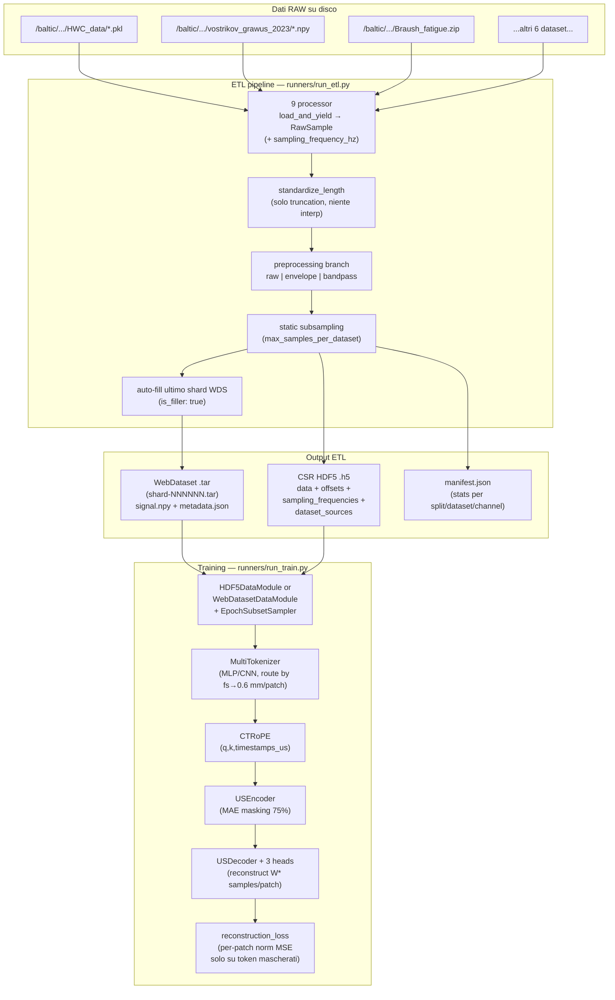

# US Foundation Model — Piano di Restructure (implementato)

Questo documento descrive l'**intera pipeline end-to-end** di `us_foundation` nel suo stato attuale — dall'ingestione dei dati RAW fino al training distribuito del Masked Autoencoder — spiegando come i vari script e moduli si interlacciano e riassumendo in modo dettagliato i 16 step del piano che sono stati completati.

> Riferimenti architetturali: `BioFoundation` + [`TimeFM`](../TimeFM-us_trf_fm) per il backbone MAE, [`MOIRAI`](../MOIRAI-main) per la logica multi-frequency / `MultiInSizeLinear`, [`MIRA`](../MIRA-main) per il `ContinuousTimeRotaryEmbedding` (CT-RoPE).

---

## 1. Albero del repository

```
us_foundation/
├── configs/
│   ├── etl/
│   │   ├── etl_config.example.yaml      # template documentato (minimal)
│   │   └── etl_config_sassauna.yaml     # config reale server sassauna
│   └── model/
│       ├── base.yaml                    # defaults condivisi (model + data + train)
│       └── experiments/
│           ├── exp_A_mode1_resample.yaml
│           ├── exp_A_mode2_multi.yaml
│           ├── exp_B1_naive.yaml
│           ├── exp_B2_static.yaml
│           ├── exp_B3_dynamic.yaml
│           ├── exp_B4_proportional.yaml
│           ├── exp_C_webdataset.yaml
│           └── exp_D_preprocessing.yaml
├── etl/                                 # ETL pipeline (MODIFICATA)
│   ├── __init__.py
│   ├── config.py                        # ETLConfig + DatasetConfig
│   ├── standardize.py                   # troncamento / envelope / bandpass
│   ├── writers.py                       # WebDataset + HDF5 (CSR-style)
│   ├── debug.py                         # QA plot (invariato)
│   ├── runner.py                        # orchestrator
│   └── processors/                      # uno script per ogni dataset raw
│       ├── base_processor.py            # RawSample + BaseDatasetProcessor
│       └── [9 processor specifici]
├── data/                                # NUOVO — DataModules PyTorch Lightning
│   ├── __init__.py
│   ├── samplers.py                      # EpochSubsetSampler (Exp B3)
│   ├── hdf5_datamodule.py               # HDF5Dataset + HDF5DataModule
│   └── webdataset_datamodule.py         # WebDatasetDataModule
├── model/                               # NUOVO — architettura MAE
│   ├── __init__.py
│   ├── tokenizer/
│   │   ├── __init__.py
│   │   └── multi_tokenizer.py           # MLPBranch + CNNBranch + MultiTokenizer
│   ├── positional/
│   │   ├── __init__.py
│   │   └── ct_rope.py                   # CT-RoPE (port da MIRA)
│   ├── backbone/
│   │   ├── __init__.py
│   │   ├── attention.py                 # MHSA + TransformerBlock con hook CT-RoPE
│   │   ├── us_encoder.py                # MAE encoder (TimeFM-inspired)
│   │   └── us_decoder.py                # MAE decoder + 3 heads di ricostruzione
│   └── us_mae.py                        # UltrasonicMAE (LightningModule)
├── runners/
│   ├── run_etl.py                       # CLI: ETL pass (+ --preprocessing_mode)
│   └── run_train.py                     # NUOVO — CLI: training PL
└── requirements.txt                     # + torch, pytorch-lightning
```

---

## 2. Data flow end-to-end



I moduli sono **completamente disaccoppiati**: l'ETL non sa nulla del modello, il DataModule non sa nulla dell'ETL se non che produce file in un certo layout, e il modello consuma solo batch "tokenizer-ready" indipendenti dal formato sorgente.

---

## 3. Interfacce chiave fra i moduli

Questa tabella riassume i "contratti" tra i vari blocchi — ogni riga è un punto di contatto in cui lo schema dei dati è rigido.

| Produttore | Consumatore | Schema |
|---|---|---|
| `processors/*.py` | `etl/runner.py` | `RawSample(signal: np.ndarray, sample_id, source_dataset, channel_idx, sampling_frequency_hz, metadata)` |
| `etl/writers.HDF5Writer` | `data/hdf5_datamodule.HDF5Dataset` | `data[offsets[i]:offsets[i+1]]` + `sampling_frequencies[i]` + `dataset_sources[i]` |
| `etl/writers.WebDatasetWriter` | `data/webdataset_datamodule.WebDatasetDataModule` | per sample: `<key>.signal.npy` + `<key>.metadata.json` (con `sampling_frequency_hz`, `dataset_source`, `is_filler`) |
| `HDF5Dataset.__getitem__` / `WebDatasetDataModule._decode_sample` | `collate_variable_length` | `{signal, sampling_frequency_hz, dataset_source, window_size, patch_timestamps_us, length}` |
| `collate_variable_length` | `UltrasonicMAE.forward` | batch dict: `{signal (B,T), signal_mask (B,T), sampling_frequency_hz (B,), window_size (B,), patch_timestamps_us (B,S), patch_mask (B,S), length (B,), dataset_source: list[str]}` |
| `MultiTokenizer.forward` | `USEncoder.forward` | `TokenizerOutput(tokens (B,S,E), padding_mask (B,S), window_size (B,), patch_timestamps_us (B,S), sampling_frequency_hz (B,))` |
| `USEncoder.forward` | `USDecoder.forward` | `{latent (B,S_vis,E), ids_restore (B,S), mask (B,S), len_keep (B,), padding_mask_visible, time_values_visible}` |
| `USDecoder.forward` | `reconstruction_loss` | `pred (B, S, W_max)` |

Il punto delicato di tutta la catena è il **padding level shift**: l'ETL salva segnali a **lunghezza nativa** (niente padding), il collate padda a `T_max` del batch, il tokenizer padda a `S_max` del batch (token-level), e il decoder produce `(B, S, W_max)` con la head `W*` selezionata per sample.

### Modalità di batching: variable-S (default) vs fixed-S

Due modalità di batching sono supportate (switch globale via `data.target_patches`):

| Modalità | `target_patches` | Forma `tokens` | Lunghezza segnale per sample | Chunking |
|---|---|---|---|---|
| **variable-S** (default, back-compat) | `null` | `(B, S_max, E)`, `S_max` varia per batch | nativa, collate padda a `T_max` | no |
| **fixed-S** (MOIRAI-like, branch-aware) | `int`, es. `50` | `(B, target_patches, E)` sempre | esattamente `target_patches · W*` (o l'ultimo chunk residuo) | sì, deterministico |

Il rationale della **fixed-S**: oggi (`variable-S`) un batch con sample a W=8 e W=32 ha token-padding mask aggressivi perché `S_max = max_b(T_b // W_b)` tende al segnale W=8 più lungo, lasciando i sample W=32 al 75% di padding. Con `target_patches = 50`, il DataModule taglia ogni acquisizione in chunk di esattamente `50 · W*` campioni (tutti i chunk vengono visti: niente drop di dati lunghi), i sample corti producono un singolo chunk con valid_patches < 50 (lo spazio residuo in `(B, 50, E)` è zero-padded e il `padding_mask` tiene traccia dei patch reali). Il transformer lavora sempre su tensori `(B, 50, E)` → compute e memoria costanti, DDP ben bilanciato.

Differenze rispetto a MOIRAI: MOIRAI fissa `max_length` in *token space* (globale, indipendente da patch_size) e usa `PatchCrop` (random crop) più `PadCollate`/`PackCollate`. La nostra variante fissa `target_patches` e deriva il target in *signal space* per ogni branch (`target_T_b = target_patches · W_b`), con chunking deterministico invece di random crop: più aggressivo sui dati (tutti i chunk visti) e più rigido (S costante).

---

## 4. I 16 step del piano — cosa è stato fatto

### Step 1 — `RawSample` arricchito
**File**: `etl/processors/base_processor.py`

Al dataclass `RawSample` è stato aggiunto il campo obbligatorio (default `None`) `sampling_frequency_hz: Optional[float]`. In più è stato introdotto un helper `BaseDatasetProcessor.sampling_frequency_hz()` che legge il valore da `self.config.extra["sampling_frequency_hz"]` e lo converte a `float`. In questo modo **ogni processor può propagare la frequenza senza duplicare la logica** e senza dipendere dalla conoscenza delle chiavi YAML.

### Step 2 — Propagazione in tutti i 9 processor
**File**: `etl/processors/{braush_contraction,braush_fatigue,giordano_heartrate,grawus,hwc,lateral_gastrocnemius_verasonics,picmus_carotid_cross,picmus_carotid_long,picmus_in_vivo_heart}_processor.py`

Ogni `yield RawSample(...)` è stato esteso con `sampling_frequency_hz=self.sampling_frequency_hz()`. Il parametro viene letto dall'`extra` del `DatasetConfig`, quindi l'onere di dichiarare la frequenza è dell'utente tramite YAML (vedi step 7). Nessun processor hard-codea la frequenza, evitando divergenze tra dataset con lo stesso formato ma frequenze diverse.

### Step 3 — Nuovi campi in `ETLConfig`
**File**: `etl/config.py`

Aggiunti / attuali in `ETLConfig` (multi-formato):
- `output_formats`, `rf_bandwidth_fraction` (larghezza di banda relativa a `extra.transmit_center_frequency_hz` per dataset), `bandpass_order`
- Per dataset in YAML: `extra.transmit_center_frequency_hz` (o `tx_fc_hz`) obbligatorio se `envelope` o `bandpass` è attivo; opzionale `extra.rf_bandwidth_fraction`
- `max_samples_per_dataset: dict` — per Experiment B2 (es. `{"lateral_gastrocnemius_verasonics": 500_000}`)
- `pad_last_shard: bool = True` — per forzare tutti gli shard WebDataset ad avere la stessa cardinalità

`target_length` è stato **ridefinito documentalmente** come *solo tetto di troncatura*; `validate()` fa ulteriori check (se `interpolate` allora `target_length` positivo; se `envelope`/`bandpass` allora `rf_bandwidth_fraction` e ogni `transmit_center_frequency_hz` per dataset).

### Step 4 — Riscrittura di `standardize.py`
**File**: `etl/standardize.py`

- `standardize_length(signal, target_length, mode)`: **rimosso** il path di interpolazione. Ora la funzione tronca solo se `len(signal) > target_length`; altrimenti restituisce il segnale invariato (dopo cast a float32).
- `compute_envelope(signal)`: utilizza `scipy.signal.hilbert` per il modulo dell'analitico (demodulazione di ampiezza).
- `compute_bandpass(signal, fs, low_hz, high_hz, order=4)`: Butterworth zero-phase con `butter + filtfilt`, guardie numeriche su `low/high` e sulla lunghezza minima del segnale; se `fs` è `None/≤0`, il segnale passa invariato (con warning a monte).
- `validate_sample` accetta ora segnali di **lunghezza variabile** (≤ `target_length`), rimosso il vincolo `size == target_length`.

### Step 5 — `runner.py` riscritto
**File**: `etl/runner.py`

Il runner segue ora un flusso pool-in-RAM (più pulito del vecchio streaming) in 8 fasi:

1. Discover file da tutti i processor.
2. Per ogni file, `load_and_yield` → `standardize_length` (solo truncation) → `sanitize_signal` → branch `preprocessing_mode`.
3. Dead-signal check, `validate_sample`, aggiunta a `all_samples: list[_KeptSample]`.
4. **Static subsampling** (Exp B2): `_apply_static_subsampling` cappa i dataset in `max_samples_per_dataset` con shuffle + cap.
5. Split a livello di sample con permutazione seedata.
6. Per ogni split, creazione dei writer e iterazione: il metadata che arriva ai writer include esplicitamente `sampling_frequency_hz`, `dataset_source`, `base_dataset`, `channel_idx`, `length`, `is_filler: false`.
7. **Auto-fill ultimo shard WebDataset**: calcolo del `deficit = (-count) % samples_per_shard`, campionamento uniforme da un pool di duplicati, scrittura con `is_filler: true`.
8. Debug QA sui canali esclusi, generazione report, `_verify_shard_divisibility`, scrittura `manifest.json`.

### Step 6 — `writers.py` con HDF5 CSR-style
**File**: `etl/writers.py`

- **`HDF5Writer`**: layout "sparse-like". Un unico buffer 1D `data: (M,) float32` accumula i segnali concatenati; `offsets: (N+1,) int64` marca inizio/fine; `sampling_frequencies: (N,) float32` e `dataset_sources: (N,)` vlen UTF-8. Il writer usa **buffer interni** (`_buf_signals` etc.) con flush ogni 1024 sample per ridurre overhead di `resize()` su HDF5. Nessun zero-padding → lo storage è proporzionale al volume reale di dati.
- **`WebDatasetWriter`**: `sink.write({"__key__", "signal.npy", "metadata.json"})`. Una utility `_make_json_safe` converte `np.integer/np.floating/np.ndarray` in tipi Python puri per permettere a `json.dumps` di funzionare senza errori.

### Step 7 — YAML ETL aggiornati
**File**: `configs/etl/etl_config_sassauna.yaml`, `configs/etl/etl_config.example.yaml`

A ogni dataset è stato aggiunto `extra.sampling_frequency_hz`. I valori assegnati (in base alle specifiche degli scanner):

| Dataset | fs | W\* scelto (0.6 mm) |
|---|---|---|
| `hwc` | 10 MHz | 8 (0.77 mm) |
| `grawus` | 10 MHz | 8 (0.77 mm) |
| `lateral_gastrocnemius_verasonics` | 20 MHz | 16 (0.62 mm) |
| `picmus_carotid_long/cross`, `picmus_in_vivo_heart` | 40.82 MHz | 32 (0.60 mm) |
| `braush_contraction`, `braush_fatigue` | 8 MHz | 8 (0.96 mm) |
| `giordano_heartrate` | 12 MHz | 8 (0.51 mm) |

Aggiunti a livello globale i campi `preprocessing_mode`, `bandpass_*`, `max_samples_per_dataset`, `pad_last_shard`. Rimossi dai YAML i campi obsoleti `interpolate_short` (non più letti dal runner).

### Step 8 — `EpochSubsetSampler`
**File**: `data/samplers.py`

Implementa Experiment B3: a ogni epoch un subset casuale di `epoch_k` indici dal pool `lg_indices` (lateral gastrocnemius) viene **unito integralmente** agli `other_indices`, mescolato, e sharded per rank DDP. Il seed è `seed + epoch` in modo che **tutti i rank pescano lo stesso subset** (fondamentale per la consistenza DDP). `set_epoch(epoch)` è chiamato dalla `HDF5DataModule.on_train_epoch_start`. `drop_last=True` garantisce lunghezza identica su tutti i rank.

### Step 9 — `HDF5Dataset` + `HDF5DataModule`
**File**: `data/hdf5_datamodule.py`

- `HDF5Dataset`: apertura **lazy** di `h5py.File` in `__getitem__` (pattern DDP-fork-safe). In `__init__` vengono caricati in RAM solo i metadati fissi: `offsets`, `sampling_frequencies`, `dataset_sources`. Viene pre-calcolato `window_for_sample[i] = select_branch(fs[i])`. `__getitem__(i)` restituisce `{signal, sampling_frequency_hz, dataset_source, window_size, patch_timestamps_us, length}`, con `patch_timestamps_us = (i·W + W/2) / fs · 1e6`.
- `HDF5DataModule`: espone `sampling_strategy ∈ {naive, static, dynamic_epoch, proportional}`. In `setup()` apre le split e, in base alla strategia, configura un `EpochSubsetSampler` (B3), un `torch.utils.data.Subset` determintico (B4 MOIRAI-threshold) o niente (B1/B2). `collate_variable_length` padda signals e timestamps al `max_len` del batch e produce le maschere.

### Step 10 — `WebDatasetDataModule`
**File**: `data/webdataset_datamodule.py`

Pipeline webdataset con:
```
SimpleShardList → [shuffle shards (se train)]
                → split_by_node → split_by_worker
                → tarfile_to_samples
                → [shuffle buffer 1000]
                → decode → map(_decode_sample) → select(not None)
                → batched(collate_variable_length)
```
`_decode_sample` legge `signal.npy` + `metadata.json`, ricava `fs`, sceglie `W* = select_branch(fs, …)`, calcola `patch_timestamps_us`. In validazione può scartare i filler (`is_filler: true`) per metriche "pure". `_estimated_num_batches` usa la garanzia di shard pieni per stimare le epoche con `with_epoch`.

### Step 11 — `MultiTokenizer`
**File**: `model/tokenizer/multi_tokenizer.py`

Routing (`select_branch`): minimizza `|W·c/(2·fs) − 0.6 mm|` su `W ∈ window_sizes`. Implementato sia a livello scalare (per il DataModule) sia batch-vettorizzato (`MultiTokenizer.route_batch`) con `argmin` su GPU.

Due branch selezionabili via YAML (`tokenizer_type`):
- **`MLPBranch`** (default, MOIRAI-style): reimplementa inline `MultiInSizeLinear`. Tensore peso `(num_W, E, max_W)` più `mask (num_W, 1, max_W)` con `1` nelle prime `W_i` colonne. Forward: patch flat `(B, S, max_W)` + `branch_idx (B,)` → somma su `i` di `(branch_idx == i) · F.linear(...)`. Inizializzazione Kaiming-uniform.
- **`CNNBranch`**: `nn.ModuleList` di `Conv1d` (uno per `W`) con `kernel_size/stride/groups/padding/bias` configurabili da YAML (default non-overlapping `kernel=stride=W`). Per ogni sample si gathera la slice del branch corretto.

Il forward restituisce `TokenizerOutput` con `tokens (B, S_max, E)`, `padding_mask`, `window_size (B,)`, `patch_timestamps_us (B, S_max)`, `sampling_frequency_hz (B,)`. I timestamp sono azzerati sulle posizioni padded (tramite la mask).

### Step 12 — CT-RoPE
**File**: `model/positional/ct_rope.py`

Port verbatim della classe `ContinuousTimeRotaryEmbedding` di MIRA (`MIRA-main/MIRA/models/modeling_mira.py` l. 211–279), ripulito dalla cache euristica basata su `hash` (non affidabile in training continuo) e dalla dipendenza su tipi HuggingFace. `CTRoPE(dim, base=10000.0)` espone `forward(q, k, time_values) → (q_rot, k_rot)` con `q, k: (B, H, S, D)` e `time_values: (B, S)`. La rotazione rispetta la formula `θ_i(t) = base^(−2i/d) · t` e usa `rotate_half`.

### Step 13 — Backbone custom
**File**: `model/backbone/{attention,us_encoder,us_decoder}.py`

- **`attention.py`**: `MultiHeadSelfAttention` con hook opzionale per CT-RoPE (applicato a `q, k` prima del prodotto interno) e `padding_mask` che maschera con `-inf` le key padded. `TransformerBlock` pre-norm (LN → MHSA → residual → LN → MLP → residual) con `MLP` 2-layer `GELU` e `mlp_ratio=4`.
- **`us_encoder.py`**: `USEncoder` riceve `tokens (B, S, E)` già embedded (nessuna `patch_embed` interna). Sostituisce i token padded con `pad_token` (parametro), esegue MAE masking tramite `_mae_shuffle_and_mask`: i token padded ricevono rumore `2.0` → finiscono in coda dell'argsort → garantito essere tra i "masked". Per ogni sample `len_keep[b] = round((1 − r) · n_valid[b])` (clamp ≥ 1). Seleziona i `S_vis_max` token visibili, costruisce la mask di visibilità, e li processa con i `TransformerBlock` passando `rotary=self.rotary` e `time_values_visible` (anch'essi gather-ati nella shuffle order). Ritorna dict con `latent`, `ids_restore`, `mask`, `len_keep`, mask di visibilità. Inizializzazione: Xavier per `nn.Linear`, costanti per `LayerNorm`, `trunc_normal_` per `mask_token/pad_token`, rescale dei proj weights à la TimeFM (`fix_init_weight` → `div_(sqrt(2·layer_id))`).
- **`us_decoder.py`**: `USDecoder` proietta `encoder_dim → decoder_dim`, reinserisce `mask_token` per le posizioni mascherate (sia le `pad_len` eccedenti sia quelle visibili oltre `len_keep[b]`), fa unshuffle con `gather(ids_restore)`, passa per `decoder_blocks` con CT-RoPE e `time_values_us` (già in original token order). Head di ricostruzione: **tre `nn.Linear` separati** (`self.heads["8"]`, `self.heads["16"]`, `self.heads["32"]`), aggregati con `(window_size_per_sample == w).view(B, 1, 1) * head_w(x)` paddato a `W_max`. Scelta motivata: con solo 3 branch la soluzione "MOIRAI `MultiOutSizeLinear`" aggiunge complessità senza benefici concreti.
- **`reconstruction_loss`** (stesso file): per ogni sample chunka `signal[b, :usable · W]` in `(usable, W)`, normalizza per patch (media/std, come MAE He et al. 2021), calcola `MSE` solo dove `mask=1 & padding_mask=1 & valid=1`.

### Step 14 — `UltrasonicMAE`
**File**: `model/us_mae.py`

`LightningModule` che cabla tutto. `save_hyperparameters` per checkpoint reproducibili. Due istanze CT-RoPE separate (una per `head_dim_enc = embed_dim/encoder_heads`, una per `head_dim_dec = decoder_dim/decoder_heads`) perché le dimensioni possono differire. `forward(batch)` esegue tokenizer → encoder → decoder e ritorna dict. `_step` computa la loss e logga `train/loss`, `val/loss`, `test/loss` con `sync_dist=True`. Optimizer: `AdamW` con parameter group splitting (bias + LayerNorm + `mask_token` + `pad_token` → no weight decay) e scheduler custom warmup + cosine epoch-based.

### Step 15 — Experiment configs
**File**: `configs/model/base.yaml`, `configs/model/experiments/*.yaml`

- `base.yaml`: defaults completi per `etl` (target_length, preprocessing), `data` (formato, sampling_strategy, batch/workers, paths, `target_patches` per fixed-S), `model` (window_sizes, embed_dim, tokenizer_type, CT-RoPE, masking_ratio), `train` (lr, warmup, epochs, devices, num_nodes, precision, output_dir).
- 8 file sotto `experiments/` con `defaults: [base]` e **solo gli override** necessari. Esempio `exp_A_mode1_resample.yaml` cambia `etl.target_freq_hz: 20_000_000`, `model.window_sizes: [16]`, `model.use_ct_rope: false`, `train.run_name`. Ogni config è pensato per essere lanciato con `python -m runners.run_train --config <path>`.

### Step 16 — `run_train.py`
**File**: `runners/run_train.py`

CLI PL completo:
- `_load_composed_yaml`: implementa `defaults: [base]` in stile Hydra-lite con `_deep_update` ricorsivo. Risolve `base` come `../base.yaml` rispetto al file experiment.
- `_apply_overrides`: supporta `--override train.max_epochs=50 model.embed_dim=512` (dot-path + `yaml.safe_load` sul valore).
- `_build_datamodule`: switch `hdf5 | webdataset` che istanzia il DataModule corretto con tutti i parametri necessari.
- `_build_model`: istanzia `UltrasonicMAE(**cfg["model"], **cfg["train"])`.
- `main`: `pl.seed_everything`, dump `config.yaml` nel run dir, `ModelCheckpoint(monitor="val/loss", save_top_k=3)` + `LearningRateMonitor`, `DDPStrategy(find_unused_parameters=False)` quando `devices > 1 || num_nodes > 1`, `precision=bf16-mixed` di default (A100-friendly), `CSVLogger`. Supporta `--ckpt-path` per resume.

Bonus: in `runners/run_etl.py` è stato aggiunto l'argomento `--preprocessing_mode {raw,envelope,bandpass}` come override CLI dello YAML.

---

## 5. Come lanciare i vari stadi

### 5.1. ETL

```bash
# Dentro us_foundation/
python -m runners.run_etl \
    --config configs/etl/etl_config_sassauna.yaml

# Override al volo del preprocessing (Exp D senza toccare YAML):
python -m runners.run_etl \
    --config configs/etl/etl_config_sassauna.yaml \
    --preprocessing_mode envelope \
    --output_dir /scratch2/msc26f8/output_test/etl_envelope
```

Output: `{output_dir}/{wds,hdf5,debug_qa,manifest.json}`.

### 5.2. Training (sassauna / locale / Leonardo)

```bash
# Single-node 4xA100:
python -m runners.run_train \
    --config configs/model/experiments/exp_A_mode2_multi.yaml

# Override esplicito:
python -m runners.run_train \
    --config configs/model/experiments/exp_B3_dynamic.yaml \
    --override train.max_epochs=50 data.batch_size=128

# Leonardo (multi-nodo) — esempio header SLURM da integrare:
#   #SBATCH --nodes=4
#   #SBATCH --gres=gpu:4
#   #SBATCH --ntasks-per-node=4
#   srun python -m runners.run_train \
#       --config configs/model/experiments/exp_A_mode2_multi.yaml \
#       --override train.devices=4 train.num_nodes=4
```

PyTorch Lightning + `DDPStrategy(find_unused_parameters=False)` gestiscono automaticamente il sharding (HDF5 via `EpochSubsetSampler` rank-aware, WebDataset via `split_by_node/worker`).

---

## 6. Matrice Experiment → file coinvolti

Ogni "switch" a livello utente si riconduce a una singola modifica YAML:

| Experiment | File ETL da rilanciare? | File training YAML | Knob principale |
|---|---|---|---|
| A Mode 1 (resample 20 MHz) | Sì — con `preprocessing_mode: raw` e (TODO: resampling a fs target) | `exp_A_mode1_resample.yaml` | `model.window_sizes: [16]`, `use_ct_rope: false` |
| A Mode 2 (multi-tokenizer) | No (riusa ETL default) | `exp_A_mode2_multi.yaml` | `model.window_sizes: [8,16,32]`, `use_ct_rope: true` |
| B1 naive | No | `exp_B1_naive.yaml` | `data.sampling_strategy: naive` |
| B2 static cap 500k | **Sì** (cap applicato al ETL) | `exp_B2_static.yaml` | `etl.max_samples_per_dataset` |
| B3 dynamic epoch | No | `exp_B3_dynamic.yaml` | `data.sampling_strategy: dynamic_epoch`, `data.format: hdf5` |
| B4 proportional | No | `exp_B4_proportional.yaml` | `data.sampling_strategy: proportional`, `data.threshold_ratio` |
| C WebDataset | No | `exp_C_webdataset.yaml` | `data.format: webdataset` |
| D preprocessing | **Sì** (envelope/bandpass sono proprietà dell'ETL) | `exp_D_preprocessing.yaml` | `etl.preprocessing_mode` |

---

## 7. Vincoli invariati e decisioni chiave

- **Nessuna interpolazione in ETL** — i segnali mantengono frequenza e lunghezza native, condizione necessaria per la validità fisica del multi-tokenizer.
- **CSR-like HDF5** per segnali variable-length senza zero-padding: risparmio di storage proporzionale alla varianza di lunghezza; `offsets` (17M × 8 B ≈ 136 MB) caricati in RAM al `__init__` del dataset.
- **WebDataset metadata per sample** (non per shard): `sampling_frequency_hz`, `dataset_source`, `is_filler` sono top-level nel `metadata.json`.
- **Padding last shard**: evita NCCL hang su DDP con epoche classiche. Filler marcati nel metadata e scartabili in validation.
- **Routing fisico**: `W* = argmin_{W∈{8,16,32}} |W·c/(2·fs) − 0.6 mm|`. Stessa funzione usata in DataModule **e** in tokenizer per garantire che i `patch_timestamps_us` precomputati siano coerenti col `W` usato dalla forward.
- **CT-RoPE applicato dentro i blocchi** (non come PE additivo sui token): Q/K ruotati a ogni layer, come nella formulazione originale.
- **Reconstruction head a 3 Linear separati**: più leggibile di `MultiOutSizeLinear` con soli 3 branch, e permette inizializzazioni/freezing per-head in futuro.
- **Solo HDF5 supporta `dynamic_epoch`**: l'astrazione stream-based di WebDataset è incompatibile con seeking random per-epoca.
- **`samples_per_shard % batch_size == 0`** e `n_shards % (world_size · num_workers) == 0` validati in `ETLConfig.validate()` + `_verify_shard_divisibility`.

---

## 8. Test rapidi di sanità

```bash
# Syntax check di tutto il repo:
python -c "import ast, pathlib; [ast.parse(p.read_text()) for p in pathlib.Path('.').rglob('*.py')]"

# ETL dry-run (1 dataset, 100 sample):
python -m runners.run_etl \
    --config configs/etl/etl_config_sassauna.yaml d\
    --output_dir /tmp/us_etl_smoke

# Training smoke test (1 batch, 1 epoch, CPU):
python -m runners.run_train \
    --config configs/model/experiments/exp_A_mode2_multi.yaml \
    --override train.max_epochs=1 train.devices=1 train.precision=32 data.batch_size=4 data.num_workers=0
```

Tutti gli import intermodulari sono indiretti tramite package `__init__.py` (`from data import HDF5DataModule, …`, `from model import UltrasonicMAE`), quindi un eventuale refactor interno di un sottomodulo non rompe i runner.
