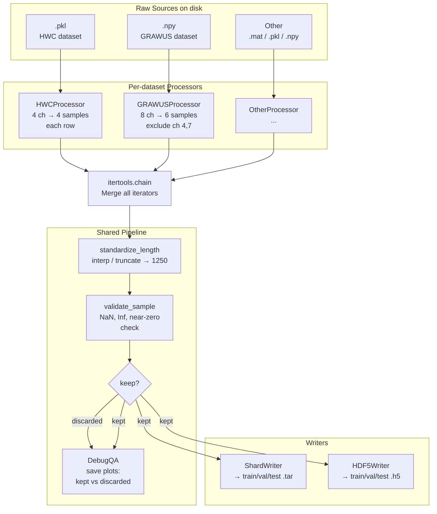

# ETL Pipeline for Ultrasound A-mode Signals

## Architecture

Each source dataset has its own `Processor` (inherits `BaseDatasetProcessor`) that knows how to read files, extract individual 1D signals, and filter out unwanted channels. The `ETLRunner` collects iterators from ALL processors, chains them into one merged stream, applies standardization and validation, runs optional QA debug, and writes the final samples directly to WebDataset tar shards and/or HDF5 files.



## File structure

```
us_foundation/
├── __init__.py
├── requirements.txt
├── etl/
│   ├── __init__.py              # Re-exports from submodules + PROCESSOR_REGISTRY
│   ├── config.py                # ETLConfig + per-dataset DatasetConfig
│   ├── standardize.py           # Interpolation / truncation / validation
│   ├── debug.py                 # QA plot generation (kept vs discarded)
│   ├── writers.py               # WebDataset ShardWriter + HDF5 writer
│   ├── runner.py                # Orchestrator: merge processors → pipeline → writers
│   ├── etl_config.example.yaml  # Example YAML configuration
│   ├── README_plan.md           # This file
│   └── processors/
│       ├── __init__.py          # Processor exports + PROCESSOR_REGISTRY
│       ├── base_processor.py    # BaseDatasetProcessor ABC + RawSample dataclass
│       ├── hwc_processor.py     # HWC .pkl processor (4 transducers)
│       └── grawus_processor.py  # GRAWUS .npy processor (8 channels)
└── runners/
    ├── __init__.py
    └── run_etl.py               # CLI entrypoint (argparse + YAML config)
```

All processors live inside `etl/processors/`. The registry mapping (name → class) is in `processors/__init__.py` and re-exported by `etl/__init__.py`.

## 1. `config.py` — Configuration

Two dataclasses:

**`DatasetConfig`** — one per source dataset, defined in the YAML config:

- `name: str` — identifier (e.g. `"hwc"`, `"grawus"`)
- `processor: str` — processor class name (maps to registry)
- `input_path: str` — root path to raw data
- `channels_to_exclude: list[int] = []` — channel indices to drop (e.g. `[4, 7]` for GRAWUS)
- `channels_to_keep: Optional[list[int]] = None` — alternative: explicit list of channels to keep
- `extra: dict = {}` — any processor-specific params (e.g. `n_channels: 8` for GRAWUS)

**`ETLConfig`** — global parameters:

- `datasets: list[DatasetConfig]` — all source datasets to process
- `target_length: int = 1250`
- `truncation_mode: str = "left"` — `"left"`, `"center"`, or `"right"` aligned crop
- `output_dir: str`
- `output_format: str = "both"` — `"webdataset"`, `"hdf5"`, or `"both"`
- `samples_per_shard: int = 1024`
- `batch_size: int = 64`
- `world_size: int = 16`
- `num_workers: int = 4`
- `split_ratios: dict = {"train": 0.8, "val": 0.1, "test": 0.1}`
- `seed: int = 42`
- `min_signal_energy: float = 1e-6` — threshold below which a signal is considered "dead"
- `debug_samples_per_class: int = 100` — how many kept/discarded plots to save per dataset
- `debug_output_dir: str = "{output_dir}/debug_qa"`

Example YAML config:

```yaml
target_length: 1250
output_dir: /scratch/us_shards
output_format: both
samples_per_shard: 1024
batch_size: 64
world_size: 16
num_workers: 4
seed: 42

datasets:
  - name: hwc
    processor: HWCProcessor
    input_path: /baltic/users/ml_datasets/Ultrasound/HWC_data/data_class/
    channels_to_exclude: []

  - name: grawus
    processor: GRAWUSProcessor
    input_path: /baltic/users/ml_datasets/Ultrasound/IIS_internal/vostrikov_grawus_2023/data
    channels_to_exclude: [4, 7]
    extra:
      n_channels: 8
      metadata_rows: 4
```

## 2. `processors/base_processor.py` — Abstract interface

```python
@dataclass
class RawSample:
    signal: np.ndarray        # 1D float array, arbitrary length
    sample_id: str            # globally unique: "{dataset}_{file}_{row}_{ch}"
    source_dataset: str       # dataset name from config
    channel_idx: int          # original channel index in source data
    metadata: dict            # labels, subject, session, etc.

class BaseDatasetProcessor(ABC):

    def __init__(self, config: DatasetConfig):
        self.config = config

    @abstractmethod
    def discover_files(self) -> list[str]:
        """Return sorted list of raw file paths found under config.input_path."""

    @abstractmethod
    def load_and_yield(self, filepath: str) -> Iterator[RawSample]:
        """Load a raw file, iterate over channels (excluding config.channels_to_exclude),
        and yield one RawSample per individual 1D signal."""

    def dataset_name(self) -> str:
        return self.config.name

    def should_keep_channel(self, ch_idx: int) -> bool:
        """Shared utility: check channel against exclusion/inclusion lists."""
        if self.config.channels_to_keep is not None:
            return ch_idx in self.config.channels_to_keep
        return ch_idx not in self.config.channels_to_exclude
```

Key: each processor's `load_and_yield` treats every channel as a separate 1D sample. Multi-channel data is "flattened" into independent samples at this stage.

## 3. `standardize.py` — Length standardization and validation

- `standardize_length(signal, target_length, mode="left")`:
  - Longer: truncate according to `mode` (left-aligned keeps first N samples, center crops from the middle, right keeps last N)
  - Shorter: `np.interp` with linear interpolation to target_length
  - Equal: pass through
  - Cast to float32

- `is_dead_signal(signal, min_energy) -> bool`:
  - Returns True if `np.mean(signal ** 2) < min_energy` (RMS energy below threshold)
  - Also True if all values are identical (constant signal)
  - Also True if any NaN or Inf

- `validate_sample(signal, target_length) -> bool`:
  - Shape check, dtype check, NaN/Inf check

## 4. `debug.py` — QA visualization

`DebugQA` class that collects samples during the ETL pass:

- Maintains two buffers per (dataset, channel_idx) pair: `kept_samples` and `discarded_samples`, each capped at `debug_samples_per_class`
- After the ETL pass (or on-the-fly if streaming), generates:
  - `{debug_dir}/{dataset}/kept/ch{X}_sample{N}.png` — plot of kept signals
  - `{debug_dir}/{dataset}/discarded/ch{X}_sample{N}.png` — plot of discarded signals
  - `{debug_dir}/{dataset}/summary.txt` — per-channel counts: total, kept, discarded, discard reasons
- Each plot: simple matplotlib line plot, title with sample_id and channel, x-axis = sample index, y-axis = amplitude
- Batch plotting: saves grid figures (e.g. 5x5 = 25 signals per image) to avoid creating thousands of individual PNGs

## 5. `writers.py` — Dual output writers

### WebDataset writer

```python
class WebDatasetWriter:
    def __init__(self, output_dir, split, samples_per_shard):
        pattern = f"{output_dir}/wds/{split}/shard-%06d.tar"
        self.sink = wds.ShardWriter(pattern, maxcount=samples_per_shard)

    def write(self, sample_id: str, signal: np.ndarray, metadata: dict):
        self.sink.write({
            "__key__": sample_id,
            "signal.npy": signal,
            "metadata.json": metadata,
        })

    def close(self):
        self.sink.close()
```

### HDF5 writer

```python
class HDF5Writer:
    def __init__(self, output_dir, split, target_length, initial_capacity=100_000):
        path = f"{output_dir}/hdf5/{split}.h5"
        self.f = h5py.File(path, "w")
        self.ds = self.f.create_dataset(
            "X", shape=(0, target_length), maxshape=(None, target_length),
            dtype="float32", chunks=(1, target_length),
        )
        self.count = 0

    def write(self, signal: np.ndarray):
        self.ds.resize(self.count + 1, axis=0)
        self.ds[self.count] = signal
        self.count += 1

    def close(self):
        self.f.close()
```

## 6. `runner.py` — Orchestrator (multi-processor merge)

```python
def run_etl(config: ETLConfig):
    # 1. Instantiate all processors
    processors = []
    for ds_cfg in config.datasets:
        cls = PROCESSOR_REGISTRY[ds_cfg.processor]
        processors.append(cls(ds_cfg))

    # 2. Discover files from ALL processors, tag with dataset name
    all_files = []  # list of (processor, filepath)
    for proc in processors:
        for f in proc.discover_files():
            all_files.append((proc, f))

    # 3. Shuffle at file level, split into train/val/test
    rng = np.random.default_rng(config.seed)
    rng.shuffle(all_files)
    train_files, val_files, test_files = split_by_ratios(all_files, config.split_ratios)

    # 4. For each split: iterate, standardize, filter, write
    debug_qa = DebugQA(config)

    for split_name, split_files in [("train", train_files), ...]:
        wds_writer = WebDatasetWriter(...)
        hdf5_writer = HDF5Writer(...)

        for proc, filepath in tqdm(split_files):
            for raw_sample in proc.load_and_yield(filepath):
                signal = standardize_length(raw_sample.signal, config.target_length)

                if is_dead_signal(signal, config.min_signal_energy):
                    debug_qa.add_discarded(raw_sample, signal)
                    continue

                if not validate_sample(signal, config.target_length):
                    debug_qa.add_discarded(raw_sample, signal)
                    continue

                debug_qa.add_kept(raw_sample, signal)
                wds_writer.write(raw_sample.sample_id, signal, raw_sample.metadata)
                hdf5_writer.write(signal)

        wds_writer.close()
        hdf5_writer.close()

    # 5. Post-processing
    debug_qa.generate_reports()
    verify_shard_divisibility(config)
    write_manifest(config, stats)  # includes per-dataset and per-split counts
```

## 7. Concrete processors

### `processors/hwc_processor.py` — HWC dataset

Source: `.pkl` files containing pandas DataFrames with columns `TR_1`, `TR_2`, `TR_3`, `TR_4` (4 ultrasound transducers), plus `label` and metadata.

```python
class HWCProcessor(BaseDatasetProcessor):
    def discover_files(self):
        return sorted(glob(f"{self.config.input_path}/*.pkl"))

    def load_and_yield(self, filepath):
        df = pd.read_pickle(filepath)
        fname = Path(filepath).stem
        for row_idx, row in df.iterrows():
            for ch_idx, col in enumerate(["TR_1", "TR_2", "TR_3", "TR_4"]):
                if not self.should_keep_channel(ch_idx):
                    continue
                signal = np.asarray(row[col], dtype=np.float32)
                yield RawSample(
                    signal=signal,
                    sample_id=f"hwc_{fname}_r{row_idx}_ch{ch_idx}",
                    source_dataset="hwc",
                    channel_idx=ch_idx,
                    metadata={"label": row.get("label"), "subject": row.get("subject_id")},
                )
```

### `processors/grawus_processor.py` — GRAWUS dataset

Source: `.npy` files. Raw shape after removing metadata rows: `(timepoints, n_channels * n_acquisitions)`. Reshape to `(n_acquisitions, n_channels, timepoints)`. Exclude channels 4 and 7.

```python
class GRAWUSProcessor(BaseDatasetProcessor):
    def discover_files(self):
        return sorted(glob(f"{self.config.input_path}/*.npy"))

    def load_and_yield(self, filepath):
        arr = np.load(filepath, allow_pickle=True)
        n_meta = self.config.extra.get("metadata_rows", 4)
        n_ch = self.config.extra.get("n_channels", 8)

        signals = arr[n_meta:, :]
        n_tp = signals.shape[0]
        n_acq = signals.shape[1] // n_ch
        data = signals.reshape(n_tp, n_acq, n_ch).transpose(1, 2, 0).astype(np.float32)
        # data shape: (n_acquisitions, n_channels, timepoints)

        fname = Path(filepath).stem
        for acq_idx in range(data.shape[0]):
            for ch_idx in range(n_ch):
                if not self.should_keep_channel(ch_idx):
                    continue
                signal = data[acq_idx, ch_idx, :]
                yield RawSample(
                    signal=signal,
                    sample_id=f"grawus_{fname}_a{acq_idx}_ch{ch_idx}",
                    source_dataset="grawus",
                    channel_idx=ch_idx,
                    metadata={"experiment": fname, "acquisition": acq_idx},
                )
```

## 8. `runners/run_etl.py` — CLI entrypoint

```bash
python -m us_foundation.runners.run_etl --config etl/etl_config.example.yaml
# or with overrides:
python -m us_foundation.runners.run_etl --config etl/etl_config.example.yaml --target_length 2048
```

Loads YAML config, parses CLI overrides, calls `runner.run_etl(config)`.

## 9. `manifest.json` — Final output report

The runner tracks counts throughout the ETL pass and writes a `manifest.json` at the end in `output_dir`. Example:

```json
{
  "config": { "target_length": 1250, "seed": 42, "..." : "..." },
  "totals": {
    "samples_seen": 1840000,
    "samples_kept": 1200000,
    "samples_discarded": 640000,
    "discard_rate": 0.348
  },
  "per_dataset": {
    "hwc": { "seen": 400000, "kept": 390000, "discarded": 10000 },
    "grawus": { "seen": 1440000, "kept": 810000, "discarded": 630000 }
  },
  "per_split": {
    "train": { "kept": 960000, "num_shards": 938, "samples_per_shard": 1024 },
    "val":   { "kept": 120000, "num_shards": 118, "samples_per_shard": 1024 },
    "test":  { "kept": 120000, "num_shards": 118, "samples_per_shard": 1024 }
  },
  "per_dataset_per_channel": {
    "grawus": {
      "ch0": { "seen": 240000, "kept": 235000 },
      "ch4": { "seen": 0, "kept": 0, "note": "excluded by config" },
      "ch7": { "seen": 0, "kept": 0, "note": "excluded by config" }
    }
  },
  "shard_divisibility_ok": true,
  "timestamp": "2026-04-03T15:30:00"
}
```

The stats are accumulated in the runner loop using a simple `Counter`/`defaultdict` structure — no extra pass needed.

## Key design decisions

- **No intermediate .npy files on disk**: raw → memory → shard/hdf5 directly
- **Multi-processor merge via `itertools.chain`**: all datasets flow into one stream, shuffled at file level across datasets for good mixing
- **Channel = sample**: multi-channel acquisitions are flattened; each channel becomes an independent 1D sample
- **Channel filtering per dataset**: `channels_to_exclude` / `channels_to_keep` in DatasetConfig, checked in `should_keep_channel()`
- **Dead signal detection**: RMS energy threshold filters out null/constant signals before writing
- **QA debug output**: grid plots of kept vs discarded signals per (dataset, channel), plus summary statistics
- **No normalization in ETL**: raw amplitude values preserved; normalization at training time
- **No augmentation in ETL**: augmentation on-the-fly at training time
- **Split at file level**: prevents data leakage from same acquisition appearing in train and test
- **Shard divisibility validation**: warns if shard count is not a multiple of `world_size * num_workers`
